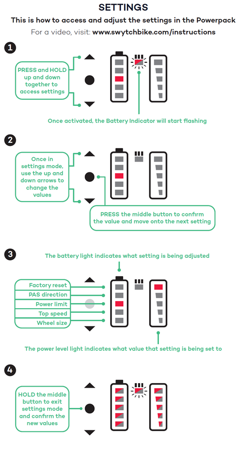
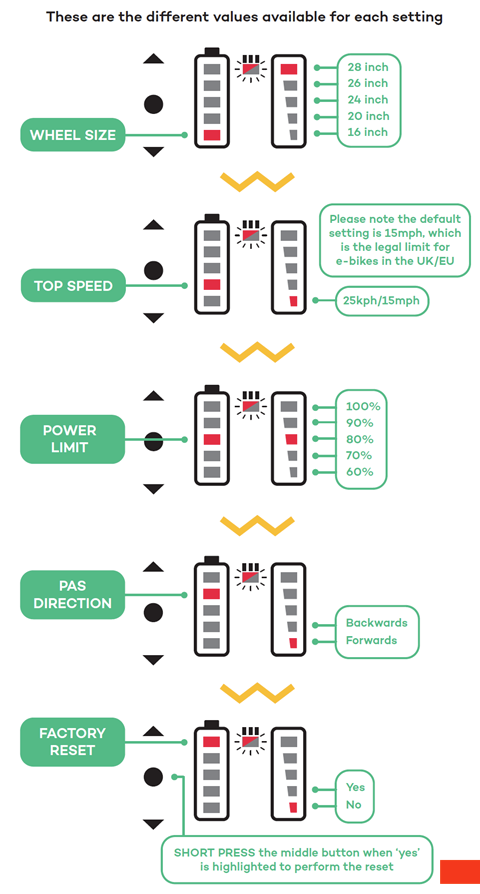
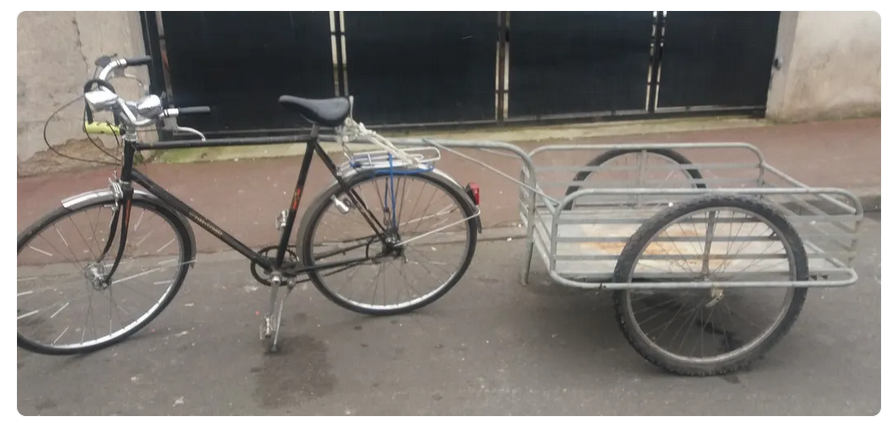
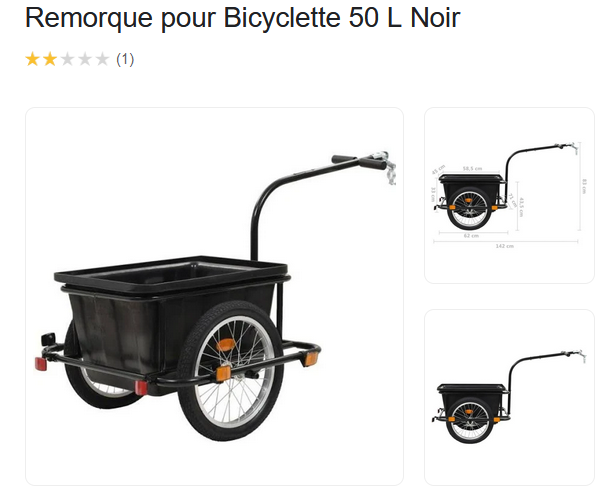
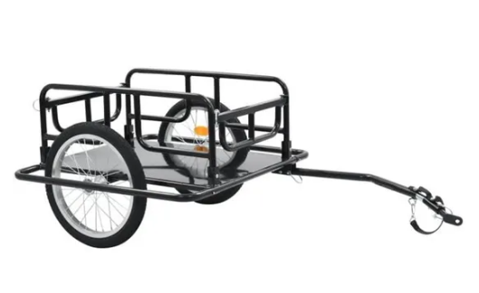

# Electric Road Bike

<!-- more -->

Manuel paramétrage du power pack :

> (https://swytchbike.zendesk.com/hc/en-gb/articles/360016217474-My-Power-Pack-is-not-working-)
>
> **Factory Reset**
>
> To Perform a Factory reset on your PRO/ECO power pack please follow the instructions below:
>
>  
>
> \1) Turn on your Power Pack
>
> \2) Hold down the upwards and downwards arrow to access the settings menu
>
> \3) Keep pressing the centre button until the left battery column is on the top light
>
> \4) Press the upward arrow so the right battery column is on the 2nd light
>
> \5) Press the centre button and hold for 3 seconds
>
>  
>
> Below are also 2 images to help demonstrate:

> **Pedal Sensor Check**
>
> Another reason to why your motor wheel is not receiving power from the battery is due to the pedal sensor connection.
>
> Please check that the pedal sensor is flashing when the pedals are rotating.
>
> If not please disconnect your pedal sensor from the Handle Bar Bracket and check for any pins out of place in the outlet.
>
> Once reconnected, if the pedal sensor still does not flash and power is not provided to the motor wheel, please contact [support@swytchbike.com](mailto:support@swytchbike.com) so our technical team can resolve this issue with further questioning.
>
>  
>
> **Power Pack Check**
>
> For this check please make sure that the Power Pack is taken off the  bike and turned off. Make sure also that rocker switch at the back of  the Power Pack is turned off.
>
> Once this has been do please unzip the Power Pack and check that all wiring is secure and no wires have come loose.
>
>  
>
> **Rocker Switch**
>
> Please make sure that the rocker switch has been turned on once the  Power Pack has been taken out of the packaging. This is a one time  switch, only to be turned off if performing the above check.

Battery type :

*NJMFY **10S2P*** -> 36V (10*3.6V and 2 in parallel for sucking more Amps ([18650 standard batteries](https://commonsensehome.com/18650-battery/)) and about 5-10 Ah)

Plug seems to be T type from what i've seen.

*Communication Interface ???* for the battery ? 12C / DQ / SMBus ?

BMS

**CRD** : max amps drawn constant - About 20Amps 

> Fortunately there's a direct relation between CDR (A) and battery  capacity (mAh). The higher the capacity, the lower the CDR. That means  devices that draw less power can take advantage of higher-capacity  cells. Hungrier devices will need to use lower-capacity cells in order  to safely draw more current.
>
> At the time of writing (June 2018), the current maximum CDR  attainable in an 18650 battery is 38A at 2000mAh. Some bogus  manufacturers claim ratings of 40A, or 35A at 3000mAh or greater, but  these are not trustworthy ratings. Battery technology evolves  constantly, so expect this to change.
>
> (https://www.makeuseof.com/tag/18650-battery/)

<u>**Gotway MCM5 :**</u>

<u>Battery type :</u> 57.6V (either 16s1p or 16s2p) 

LHY16S : board for the gestion of the battery charge-discharge.

<u>Dismantling :</u>

https://www.youtube.com/watch?v=KuzxQKTIXiw

<u>Remorque vélo :</u>

Peut être faite assez "facilement" avec deux roues de vélo (petites ?) et un chassis en barres d'alu soudées au TIG/MIG