# Internet backbone

Visual documentation assembled after reading [Wired's article](https://www.wired.co.uk/article/subsea-cables-google-facebook) on Google and Facebook's internet subsea cables. These images are not specific to the cables backed by these two compagnies.

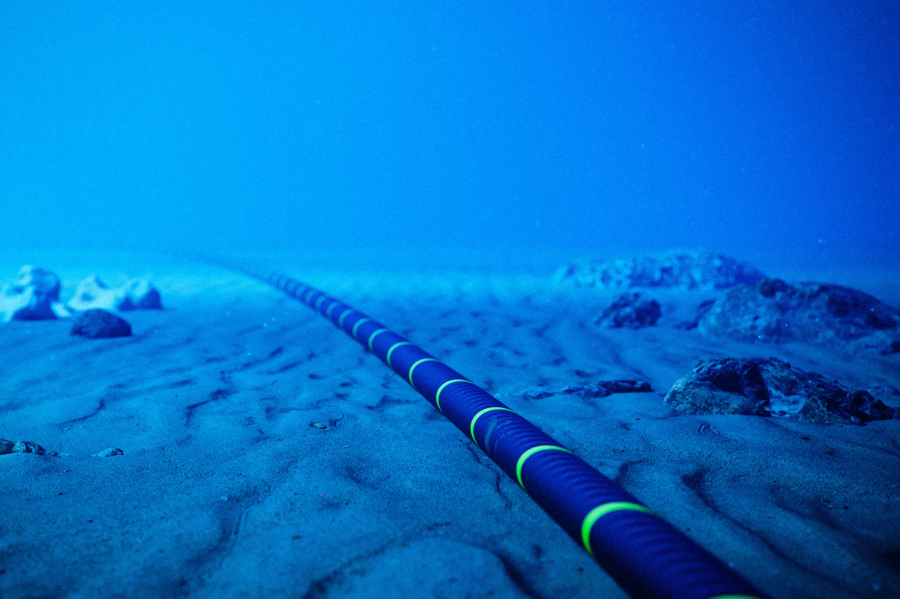{ width=800px }
<!-- more -->

Internet cables undersea to connect land patches together are more numerous each year, yet they represent a huge infrastructural cost and are potentially very fragile. The map of the currentely deployed undersea data cables and their names is available [through this dynamic interface](https://www.submarinecablemap.com/).

The [process](https://www.youtube.com/watch?v=yd1JhZzoS6A) of installing this infrastructure is quite interesting :

## The Cable : 

First off, the cables themselves are not so thick, but quite "engineered" compared to what we are accustomed to.

### Structure :

<figure markdown="span" src="https://www.empowerafrica.com/wp-content/uploads/2020/05/Submarine_Optical_Cables-1536x1028.jpg">
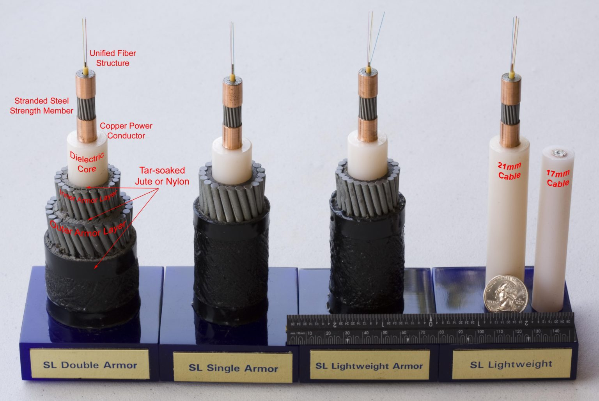{align=left, width=800px}{align=right, width=800px}
<figcaption>Fiber optic cables of various armoring thichnesses</figcaption>
</figure>
<figure markdown="span">
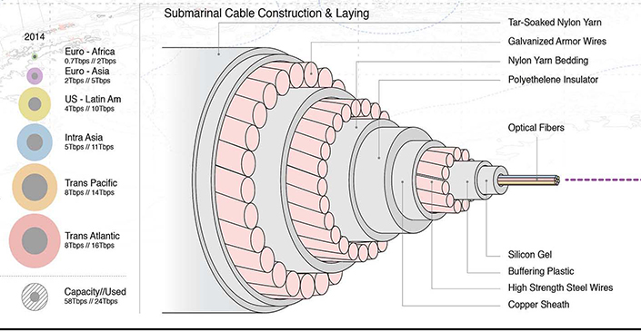{ width=800px }
<figcaption>Schematic cross section of a fiber optic undersea armored cable </figcaption>
</figure>

They are built in a similar way compared to undersea short range power (+data) cables :

<figure markdown="span" src1="https://limn.it/wp-content/uploads/2018/02/strangling-the-internet-6.jpg" src2="https://www.scmp.com/sites/default/files/styles/486w/public/2015/10/01/underwater-cable-cross-section.jpg?itok=d6Lkq51W" src3="https://www.modding.fr/wp-content/uploads/2015/10/russia-internet-3.jpg">
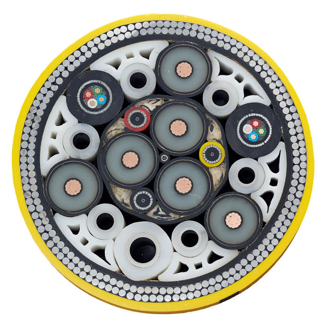{width=500px}  

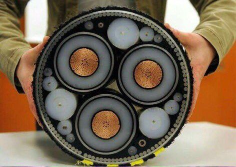{width=500px}  

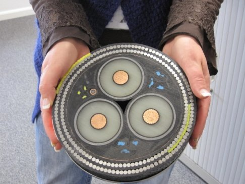{width=500px}  

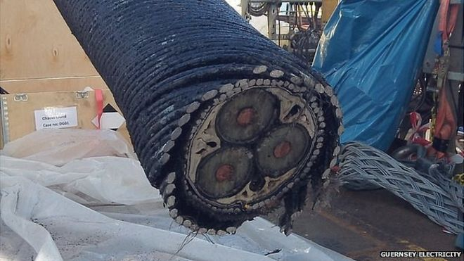{width=500px}
<figcaption>Electric power and data cable, without optical fibers</figcaption></figure>
### Manufacture :

<figure markdown="span" >
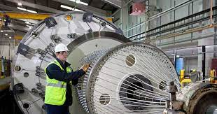{ width=800px }  

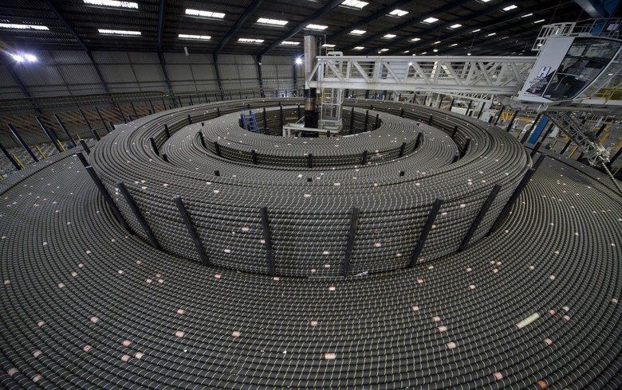{  width=800px }
<figcaption>Manufacturing the armored cables</figcaption>
</figure>

## Installation :

### Carrier Ships :

<figure markdown="span" >
{  width=800px }
{ width=800px }
<figcaption>Manufacturing the armored cables</figcaption></figure>
### Loading :

<figure markdown="span" src="https://cdn.offshorewind.biz/wp-content/uploads/sites/2/2013/03/30192334/Prysmian-Signs-EUR-50-Million-Deutsche-Bucht-Contract.jpg" src2="https://i.pinimg.com/originals/4f/a2/b3/4fa2b3a89e0b6ddade0a407e5d62e533.jpg" src3="https://media.wired.com/photos/5ca6989ff1f7d24dae56aa30/16:9/w_2400,h_1350,c_limit/Cable-Tank-Loading-Ship-SubCom-MAIN.jpg">
{ width=800px }  
{ width=800px }  

{ width=800px }
<figcaption>Storing the cables in the ship, in circular "silos" for the spool</figcaption></figure>
### Unwinding :

<figure markdown="span" src="https://resources.stuff.co.nz/content/dam/images/1/n/w/4/i/m/image.related.StuffLandscapeSixteenByNine.710x400.1nvx1r.png/1516757654836.jpg" src2="https://www.rnz.co.nz/assets/news_crops/50064/eight_col_hawaiki_-_cable.JPG?1516338059"
src3="https://wi-images.condecdn.net/image/xJ6r4nOalZn/crop/3240/f/photo-2-installation-ship_print.jpg" 
src4="https://cdn.vox-cdn.com/thumbor/xE0fhz_L-thTY6I0AZGPyHMYM0A=/1400x1400/filters:format(jpeg)/cdn.vox-cdn.com/uploads/chorus_asset/file/9318819/Photo_1_Cable_on_ship_768x512.jpg">
{ width=800px }  

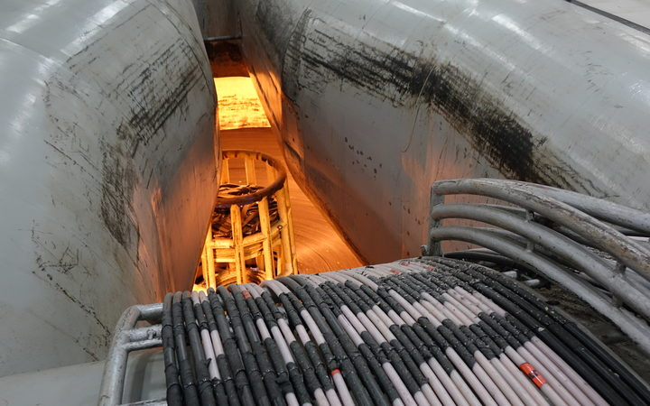{ width=800px }  

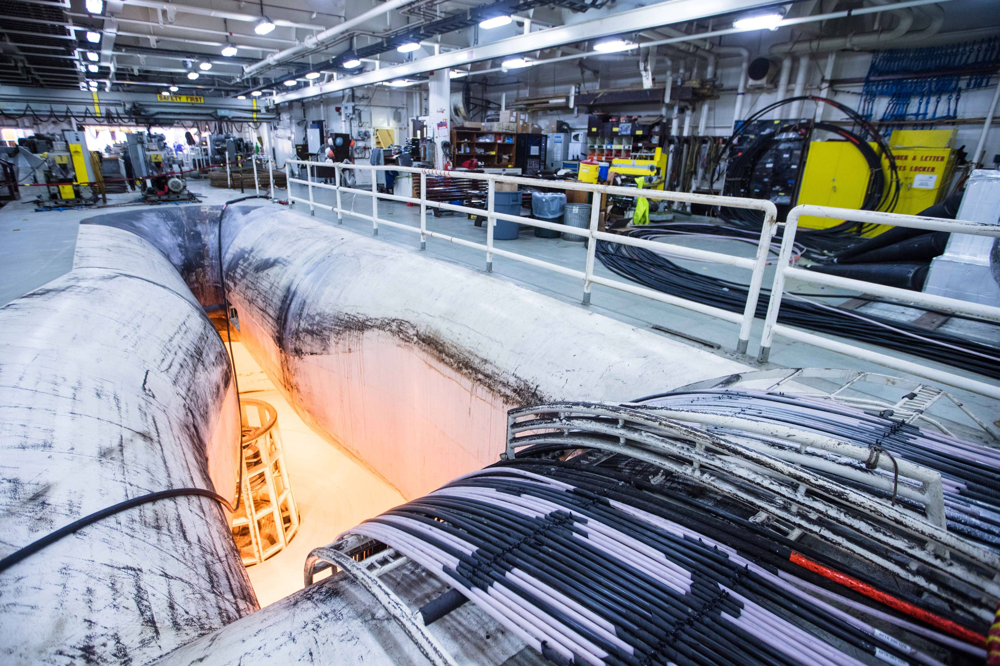{ width=800px }  

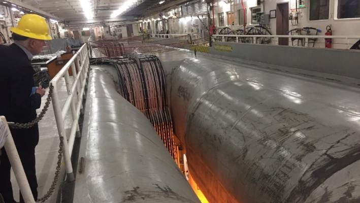{ width=800px }  

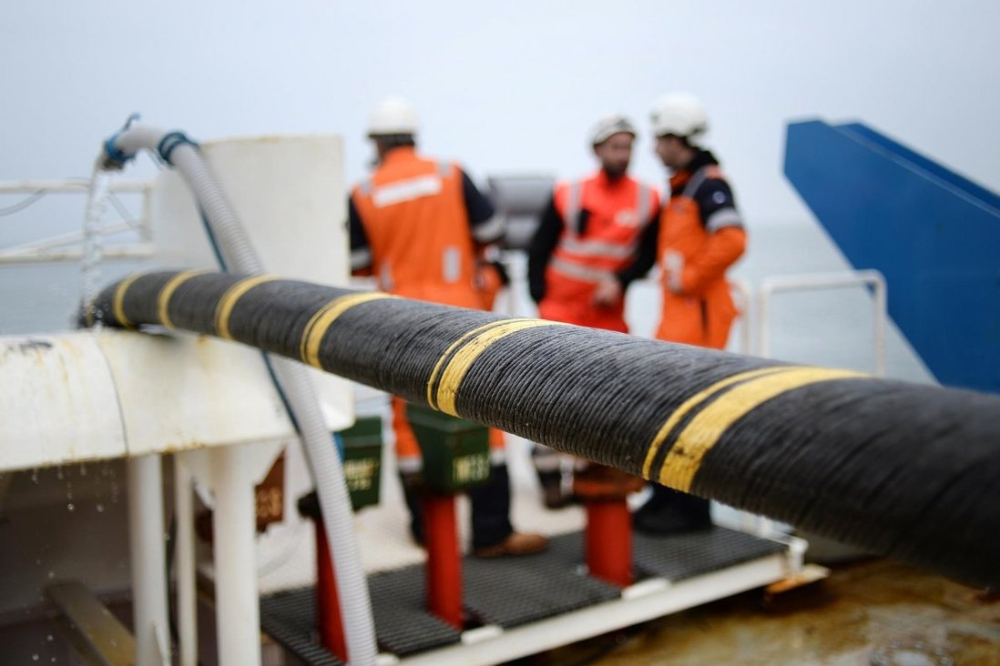{ width=800px }  

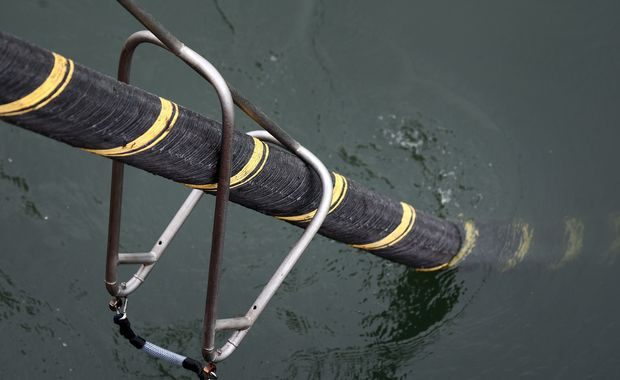{ width=800px }
<figcaption>Cables from ship spool storage to the sea</figcaption></figure>
### Joining spool endings at sea : 

When joining spools together, they need repeaters (that are powered with high voltage using the copper sheats used as fiber protective coat to provide the current).

<figure markdown="span" src="https://i.pinimg.com/originals/8e/8d/20/8e8d204bbfda3914fb567f6c6600ccb5.jpg" src="https://static01.nyt.com/newsgraphics/2019/02/15/undersea-cables/assets/images/men-at-track-480_x2.jpg" src="https://img.i-scmp.com/cdn-cgi/image/fit=contain,width=1098,format=auto/sites/default/files/styles/1200x800/public/2015/10/01/86ac254b7ec540b5455f0fddfc319568.jpg?itok=5mVEZVQl">
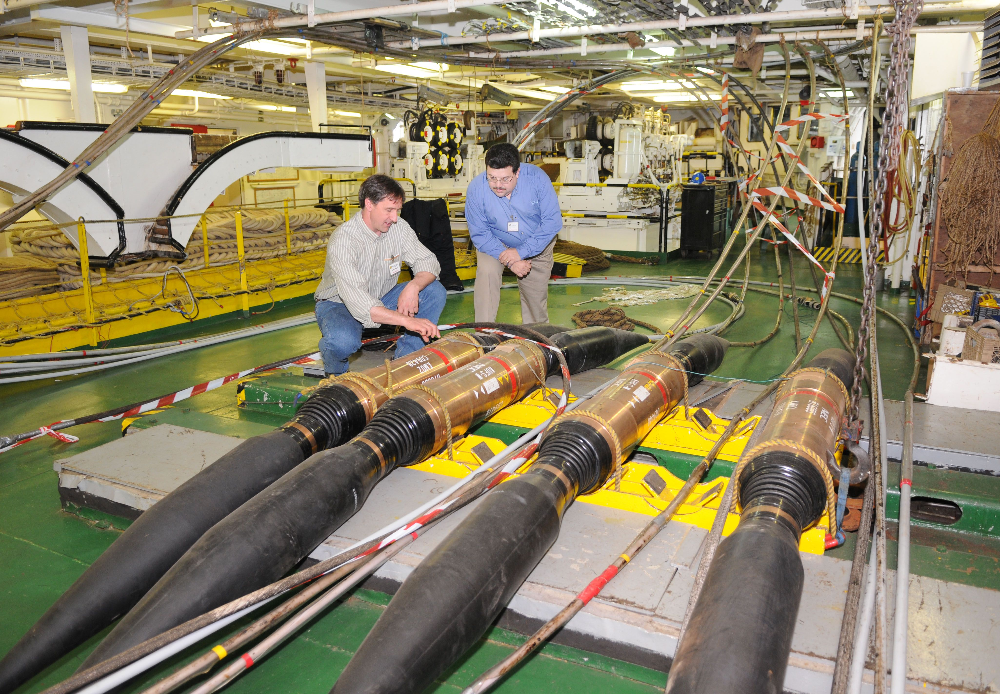{ width=800px }  

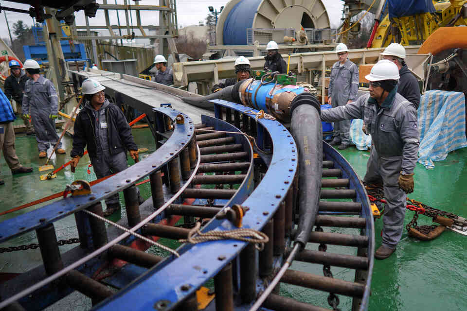{ width=800px }  

{ width=800px }
<figcaption>Cable with attached repeater going at sea</figcaption></figure>