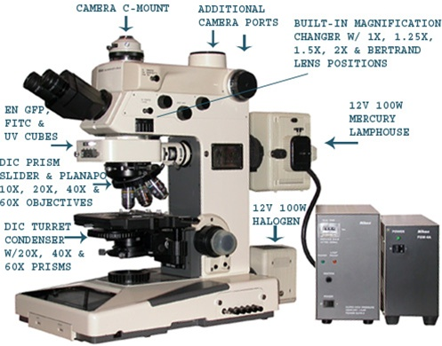

## Induction motor speed control :

Searched characteristics of a potter's wheel [ref](https://www.le-blog-du-bol.fr/tour-de-potier-guide-complet/)

Triac vs Variable Frequency Drive for speed control [ref](https://blog.orientalmotor.com/speed-control-basics-speed-control-methods-of-ac-induction-motors)

Tune the PID : [ref](https://www.thorlabs.com/newgrouppage9.cfm?objectgroup_id=9013)

## Snapmaker 2 :

[Extension module DIY](https://forum.snapmaker.com/t/custom-extention-module/13424)

**Recyclage de filament :** 

Protocycler : https://redetec.com/products/protocycler

[Servo vs Stepper vs Hybrid motors for CNC control](https://simxperience.com/Community/SimXperienceDevelopersBlog/TabId/783/ArtMID/1674/ArticleID/28/Hybrid-Stepper-Servo-vs-Traditional-Stepper-vs-Traditional-Servo.aspx)

[Bit more detailed servo and stepper infos](https://www.machinedesign.com/mechanical-motion-systems/article/21836868/whats-the-difference-between-servo-and-stepper-motors) 

## Reprap Printers :

[Comparatif differents metal 3D printers brands and technologies on the market](https://www.aniwaa.com/buyers-guide/3d-printers/best-metal-3d-printer/#Main_types_of_metal_3D_printing_technologies)

[3D printed thermite paste](https://hackaday.com/2020/09/10/3d-printed-thermite-brings-the-heat-and-the-safety/)

**Ultimaker :**

!!! info "Hacking NFC chip of spools:"
    Forum concerns [here](https://community.ultimaker.com/topic/19648-readwrite-nfc-tags/) claims to be able to do so with the [Spool-Maker](https://github.com/DA-Osborne/Spool-Maker) library from DA-Osbborne. It uses the ACR122U SmartCard reader and Mifare Ultralight (aka NTAG216) tags.

## Recovered scrap devices :

Sony XCD-SX90 : Firewire IEEE 1394 "s800" data - [Hirose 12 pin](https://www.conrad.fr/p/cosse-cylindrique-male-hirose-electronic-hr10a-10p-12s73-femelle-droit-nbr-total-de-poles-12-1-pcs-745329)s HR10A-10P-12S for IO's and alim. (wrongly said Hirose EIAJ 12p in datasheet)

Nikon Microphot FXA fluorescence microscope : NIKON MICROPHOT FXA 

## Electronic testing :

Oscilloscope USB & analyseur logique : [HANTEK 6022BL](https://www.hantek.fr/analyseurs-logiques/53-hantek-6022bl-oscilloscope-usb-et-analyseur-logique.html)

Open source signal analyser / oscilloscope software ( locic analysers, osciloscopes, multimeters...) : [Sigrok](https://sigrok.org/wiki/Downloads)

[issues with sigrok stuff](https://sigrok.org/bugzilla/show_bug.cgi?id=1517)

[Sigrok drivers](https://www.sigrok.org/blog/windows-support-and-installers)

## Audio :

**Preamps :** 

[Behringer preamp usb for microphone / instrument](https://www.thomann.de/fr/behringer_u_phoria_umc22.htm)

[Behringer USB tube preamp for microphone / instrument](https://www.thomann.de/fr/behringer_mic500usb_tube_ultragain.htm)

## Accessories :

[Tablette cintiq 13hd](https://www.backmarket.fr/tablette-graphique-wacom-cintiq-13hd-pen-display-noir-pas-cher/264998.html#l=1)

## DIY stuff :

[3D printed Speaker](https://www.thingiverse.com/thing:4668173)

[Hot wire foam cutter](https://www.thingiverse.com/thing:4670285)

[Plotter on tiny OLED screen for integrated projects](https://learn.adafruit.com/clue-sensor-plotter-circuitpython)

[Fan powered by peltier module and a candle](https://www.instructables.com/Thermoelectric-Fan-Driven-by-a-Candle/)

[Pick and place DIY](https://hackaday.com/2020/05/11/open-source-pick-and-place-has-a-450-bom-cost/)

[Prop Shield by PJRC with led , accelerometer, audio and flash memory capabilities](https://www.pjrc.com/store/prop_shield.html)

[IMU noodle](https://hackaday.com/2017/03/31/an-introduction-to-differential-i%C2%B2c/)

[SpotMicro](https://www.youtube.com/watch?v=NudqEaxzqT8) - Mini Spot robot as from Boston Dynamics but with RC servos

## NAS :

 PFsense netgate low cost low consumption router : [Low cost model](https://store.viatitude.com/gb/pfsense-security-gateway-appliance/42-sg-1100-pfsense-security-gateway-appliance.html)

[Slightly higher cost model](https://store.viatitude.com/gb/pfsense-security-gateway-appliance/30-sg-3100-pfsense-security-gateway-appliance.html)

## Artisanat :

[Pottery kiln buying advices](https://www.thesprucecrafts.com/kiln-buying-basics-2746118)   -  [Studio for pottery making advices](https://www.thesprucecrafts.com/set-up-your-pottery-studio-2746268)  -  [Advices for electric potter's wheel features 0 to 240 RPM](https://www.thesprucecrafts.com/aspects-of-electric-potters-wheels-2745977)