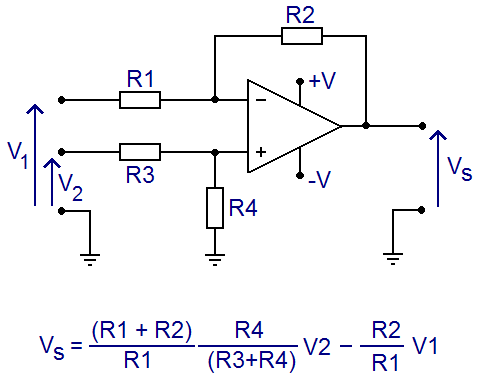
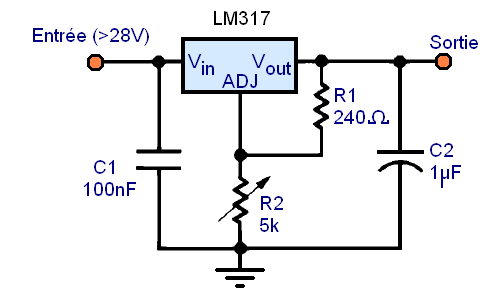
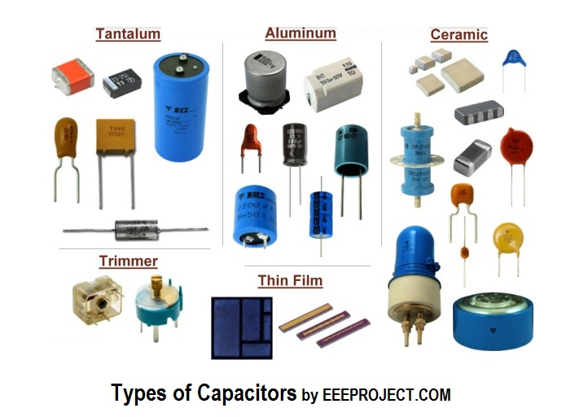

## Theory :

[Push Pull - Totem Pole](https://fr.wikipedia.org/wiki/Push-pull_(%C3%A9lectronique))

### Oddities :

- [Impédance caractéristique](https://fr.wikipedia.org/wiki/Imp%C3%A9dance_caract%C3%A9ristique) 


- [Ternary electronics](https://en.wikipedia.org/wiki/Ternary_computer) : it's a thing that exists...

> A **ternary computer** (also called **trinary computer**) is a [computer](https://en.wikipedia.org/wiki/Computer) that uses [ternary logic](https://en.wikipedia.org/wiki/Ternary_logic) (three possible values) instead of the more popular [binary system](https://en.wikipedia.org/wiki/Binary_number) ("Base 2") in its calculations.

- Humming (power supply resultant parasitic frequencies)

- [Memristors](https://fr.wikipedia.org/wiki/Memristor#Applications_potentielles) 

> En [électronique](https://fr.wikipedia.org/wiki/Électronique_(technique)), le **memristor** (ou *memristance*) est un [composant électronique passif](https://fr.wikipedia.org/wiki/Composant_passif). Il a été décrit comme le quatrième composant passif élémentaire, aux côtés du [condensateur](https://fr.wikipedia.org/wiki/Condensateur_(électricité)) (ou *capacité)*, du [résistor](https://fr.wikipedia.org/wiki/Résistor) (ou *résistance)* et de la [bobine](https://fr.wikipedia.org/wiki/Bobine_(électricité))[1](https://fr.wikipedia.org/wiki/Memristor#cite_note-1),[2](https://fr.wikipedia.org/wiki/Memristor#cite_note-2)(ou *inductance)*. Le nom est un [mot-valise](https://fr.wikipedia.org/wiki/Mot-valise) formé à partir des deux mots anglais *[memory](https://fr.wiktionary.org/wiki/memory)* et *[resistor](https://fr.wiktionary.org/wiki/resistor)*.
>
> Un memristor stocke efficacement l’information car la valeur de  sa résistance électrique change, de façon permanente, lorsqu’un courant  est appliqué[3](https://fr.wikipedia.org/wiki/Memristor#cite_note-IeeeSpectrum20081201-3). 


## Making circuits :

### Decoupling capacitors : 

[Why are they necessary](https://www.protoexpress.com/blog/decoupling-capacitor-use/#Why_is_decoupling_necessary) ? 

Usually : A **0.1uF** capacitor between ground and  supply planes before entry inside the IC, FOR EACH IC.

And one **10uF** capacitor between ground and supply plane for all ICs.


## Cables & Connectors

### Cables :


**AWG** est une unité de mesure standardisée américaine qui classe les conducteurs électriques suivant leur diamètre. Plus la valeur AWG est élevée, plus le diamètre est petit.

Cette table de conversion représente les dimensions (diamètre, section), la résistance et le courant maximum supporté par les conducteurs suivant leur classement AWG (American Wire Gauge). 

Ces valeurs sont effectives pour des conducteurs cuivre.


### Connectors :

PCB side connectos : [Castellated edge holes](https://cdn.pcbdirectory.com/uploads/1592067699891_637276645009460382.png) ( or semi plated holes )


https://learn.sparkfun.com/tutorials/connector-basics/all

#### JST-SH or Qwiic (small form factor wire to board):

<u>JST is [not a connector](https://hackaday.com/2017/12/27/jst-is-not-a-connector/) !</u> 

[JST board to board connectors](https://www.jst.co.uk/products.php?cat=17)

[Qwiic cable from sparkfun /](https://www.sparkfun.com/products/15081) 1mm JST-SH  :arrow_right::no_entry_sign: Molex Picoblade / JST-ZH / JST-XH 

Is it possible to crimp at home without machine JST-SH 1mm terminals : [answer: not unless you have the JST expensive crimp tool (about 800$)](https://electronics.stackexchange.com/questions/400717/is-it-possible-to-hand-crimp-a-1mm-pitch-jst-sh-connector-without-a-machine)

<u>Buy them already crimped :</u>

[Adafruit pour acheter JST-SH 4 pins pré-sertis (USA)](https://www.adafruit.com/product/4210)

[Gotronic pour acheter JST-SH 4 pins pré-sertis (FR)](https://www.gotronic.fr/art-cordon-grove-jst-sh-4-broches-28011.htm)

#### JST - XH (wire to board)


#### JST - VH (10A higher load board connectors : 3.93 mm pitch)

#### JST - XA (wire to wire)


#### Classic 2.54 pins :

Wire to board :  Molex KK (molex :poop:) as by [this guy on internet](https://www.eevblog.com/forum/projects/what-are-your-faviurite-wire-to-board-connectors/) : 

> JST XH (2.5mm) : very cheap, well designed, good retention polarisation, SMD and TH versions.
> Crimp tools are very good, though expensive. 
> Way better than Molex's overpriced, poorly retaining, single-side contact KK  

Wire to wire :  E.I. – Economical Interconnect – TE, Formerly Tyco, Formerly AMP E.I

http://tech.mattmillman.com/info/crimpconnectors/

[Connecteurs "LED strip (cable to cable asez petit)"](https://www.digikey.fr/product-detail/fr/sparkfun-electronics/CAB-14576/1568-1832-ND/8543396?utm_adgroup=General&utm_source=google&utm_medium=cpc&utm_campaign=Smart%20Shopping_Product_Zombie%20SKU&utm_term=&productid=8543396&gclid=CjwKCAiAz4b_BRBbEiwA5XlVVucZyUc7RIpfcbKMsxLMQUa4IDb94zdRTxAuCZss8SwqVwjV5DH9-hoCeq0QAvD_BwE)

To crimp most "common size" terminals, PA-90 and PA-20 : "generic crimp tools Engineer PA series sold by Adafruit and others" are fine : [Cheatsheet of compatibility and dies choice for each cable size and terminal type](https://media.digikey.com/pdf/Data%20Sheets/Adafruit%20PDFs/PA-09_PA-20_Compatibility_Chart_5-4-17.pdf)

#### PZN : 

Omnetics PZN Nano strip miniature polarized connectors [ref](https://www.omnetics.com/products/neuro-connectors/nano-strip-polarized)

#### SLC :

<u>Spring Loaded Connectors</u> - [How to choose](https://www.amphenol.com/node/5028) them

[Mill-Max](https://www.mill-max.com/products)® (do not manufacture only spring loaded connectors) 

DigiKey's Spring loaded connectors video [tutorial](https://www.youtube.com/watch?v=ki94SZeJLxc)


#### RotaConnect :

[Amphenol rotaconnect](https://www.amphenol.com/node/5028) : connectors 

> The RotaConnect® BtB range is a unique rotatable Board-to-Board SMT  connector that can be used to support perpendicular, coplanar and angled connections, in multiple mating and un-mating directions.

  

### Slip Rings :

[List of products on Cosmau tech](https://www.cosmau-tech.com/products/slip-rings.html)

JinPat

SenRing

[Kuebler](https://www.kuebler.com/en/products/transmission/slip-rings)

[Moog](https://www.moog.com/products/slip-rings.html)


## Signal

### Analogic electronics :

[Prevent retrigger of NE 555](https://www.eevblog.com/forum/beginners/is-there-a-way-to-prevent-re-trigger-on-one-shot-(555)/)


- Website about electronics montages : [LearnAboutElectronics](http://www.learningaboutelectronics.com)

- Website with a lot of infos on amplifier types, impedance and so on : 

[https://www.epsic.ch](https://www.epsic.ch/cours/electronique/techn99/elnthcircuit/ciatstxt.html)

- Website with courses on operational amplifiers - theory and practice :

[http://www.bedwani.ch](http://www.bedwani.ch/electro/ch9/)

- Various low pass filters (RC passive, op amp active...) ([online calculator](http://www.learningaboutelectronics.com/Articles/Low-pass-filter-calculator.php#answer3))
- Various high pass filters : ([online calculator](http://www.learningaboutelectronics.com/Articles/High-pass-filter-calculator.php))

<u>Ampli ops montage types :</u> 

- montage soustracteur :



- montage sommateur avec coefficients
- Inverting Op Amp Low Pass Filter ([online calculator](http://www.learningaboutelectronics.com/Articles/Low-pass-filter-calculator.php#answer3))
- [Differentiator](https://www.productinfo.schneider-electric.com/pm8000/viewer/595e26f146e0fb0001f6ffc4/5a33c8e246e0fb000189342e/r/IONRef_DifferentiatorModule_0000098040)
- [Op amp differentiator](https://www.electronics-notes.com/articles/analogue_circuits/operational-amplifier-op-amp/analogue-differentiator-circuit.php)
- [Differentiator amplifier](https://www.electronics-tutorials.ws/opamp/opamp_7.html)

<u>Appareils traitement signal analogique :</u>

[Window discriminator](https://www.dagan.com/wd2.htm)

[Low pass filter calculator](http://www.learningaboutelectronics.com/Articles/Low-pass-filter-calculator.php#answer3)

### Signal to Noise Ratio : 

> **Signal-to-noise ratio** (**SNR**), which is equal to the **mean divided by the standard deviation**. 
>
> [source](https://www.analog.com/media/en/technical-documentation/dsp-book/dsp_book_Ch2.pdf)

> Pour définir la façon dont le bruit affecte l'image, on produit ou on reproduit des plages uniformes. La variation du signal sur une plage  définit le bruit qui affecte l'image. Sur cette plage, la [luminance](https://fr.wikipedia.org/wiki/Luminance) ou une grandeur qui lui est proportionnelle définit le niveau nominal.
>
> Pour définir un rapport signal sur bruit qui ressemble à celui de l'électronique, on  postule arbitrairement que la « puissance » est  proportionnelle au carré de cette grandeur. La puissance du bruit est,  elle, définie comme en électronique par la variation autour de la valeur nominale. Le rapport signal sur bruit est le rapport de cette  « puissance » de l'image à celle du bruit
>
> [source](https://fr.wikipedia.org/wiki/Rapport_signal_sur_bruit)

[Scipy implementation in python](https://github.com/scipy/scipy/blob/v0.16.0/scipy/stats/stats.py#L1963) and [concerns on stack overflow](https://stackoverflow.com/questions/63177236/how-to-calculate-signal-to-noise-ratio-using-python)

## Communication :

### Serial :

- **COBS** or **[Consistent Overhead Byte Stuffing](https://en.wikipedia.org/wiki/Consistent_Overhead_Byte_Stuffing)**, allows to change one byte, usually 00 as another value along a packet and descypher it back, by adding only one overhead byte. This in turns allow to use this specific byte value as an unique frame delimiter.
- **CRC** or [Cyclic Redundancy Check](https://en.wikipedia.org/wiki/Cyclic_redundancy_check) is an error detecting algorithm. They are popular because they are simple to implement in binary [hardware](https://en.wikipedia.org/wiki/Computer_hardware), easy to analyze mathematically, and particularly good at detecting common errors caused by [noise](https://en.wikipedia.org/wiki/Noise_(electronics)) in transmission channels.


#### Parallel :

## Power :

### Power control :

Triac : MOC3021

Optocoupleur lecture phase 220V : 4N35

[Controle energy injection from 220V hardware](https://circuitmaker.com/Projects/Details/Joe-Vovk/220VAC-Dimmer-DANGEROUS-Arduino-controlled) 

- Variable frequency driver (VFD) [electronoobs](https://electronoobs.com/eng_circuitos_tut42.php) [video link](https://www.youtube.com/watch?v=FElPFGyNI3k)

### Power regulation :

[ML317 regulateur tension variable](https://www.astuces-pratiques.fr/electronique/regulateur-de-tension-lm317-montages)



La tension de sortie vaut : 
$$
V_{out} = 1,25 \;  V \;  (1 + {R2\over R1})
$$
La tension d'entrée doit être supérieure de 3 Volts à la tension de sortie maximale

**R1 ne doit pas dépasser 240 Ohms pour garantir au moins 5 mA de courant de sortie.**

Pour courants faibles, choisir des régulateurs dits **<u>"micropower"</u>**


Resolution : pour voltage de **1.25 à 12 V** : 
$$
V = 1.25 ( 1 + { { 1 \over { {1 \over Pot} +  {1 \over 2000 \; \Omega} } } \over 200 } )
$$
R1 : **0-10K** pot, in parallel with **2000** Ohm resistance.

R2 : **200** Ohm


R1 **150** ohms

R2 **67** ohms :  Vout = 1,8V

- 230V 10A voltage regulator [ref](https://fr.rs-online.com/web/p/regulateurs-de-tension/0307957/?relevancy-data=7365617263685F636173636164655F6F726465723D31267365617263685F696E746572666163655F6E616D653D4931384E525353746F636B4E756D626572267365617263685F6C616E67756167655F757365643D656E267365617263685F6D617463685F6D6F64653D6D61746368616C6C267365617263685F7061747465726E5F6D6174636865643D5E2828282872737C5253295B205D3F293F285C647B337D5B5C2D5C735D3F5C647B332C347D5B705061415D3F29297C283235285C647B387D7C5C647B317D5C2D5C647B377D29292924267365617263685F7061747465726E5F6F726465723D31267365617263685F73745F6E6F726D616C697365643D59267365617263685F726573706F6E73655F616374696F6E3D267365617263685F747970653D52535F53544F434B5F4E554D424552267365617263685F77696C645F63617264696E675F6D6F64653D4E4F4E45267365617263685F6B6579776F72643D3330372D393537267365617263685F6B6579776F72645F6170703D30333037393537267365617263685F636F6E6669673D3126&searchHistory=%7B%22enabled%22%3Atrue%7D)

	[and datasheet](https://docs.rs-online.com/803f/0900766b8138652f.pdf)

### Batteries :

Learn everything about batteries : [Battery University](https://batteryuniversity.com)

<u>Lithium ion  :</u>

- [3.7V Lipolymer batteries](https://www.ebay.com/b/3-7V-Lithium-Multipurpose-Rechargeable-Batteries/48619/bn_57020267)
	- Smallest form : [10x15x3.5 - 50mAh](https://www.ebay.com/itm/10-pcs-3-7v-351015-50mAh-Lipo-Polymer-Rechargeable-Battery-For-Headphone-MP3-GPS/174558577262?hash=item28a480826e:g:RV0AAOSwxmJfu2sW)
	- [250 mAh - JST SH 1.0](https://www.ebay.com/itm/3-7v-402035-250mAh-Lipo-Li-Polymer-Battery-JST-3pin-1-0-1-25-1-5-2-0-2-54-Plug/123867953420?hash=item1cd71af90c:g:qUoAAOSwf71dS~Rk&var=424596098860)

- 18650 Batteries 3.7V batteries 


<u>Modules to charge and discharge:</u> 

- [Micro USB 3.7 V LITHIUM Li-ion 18650 Battery Charger modules Boost Step Up adjustable 5 V to 12 V](https://www.ebay.fr/itm/Micro-USB-3-7V-Lithium-Li-ion-18650-Battery-Charger-Module-Boost-Step-Up-5V-12V/233217533194?hash=item364cd9250a:g:hbQAAOSwOzBczpxG)


### Overcurrent protection :

[DIY Short Circuit (Overcurrent) Protection](https://www.youtube.com/watch?v=7ctPSgaLxbc)


## Microcontrollers :

Most pinouts :  https://ouilogique.com/pinouts/

[Blyst Nano (fingertip ARM and bluetooth microcontroller)](https://www.crowdsupply.com/i-syst/blyst-nano)

 [Raspberry Pi consuption rating across models :](https://www.pidramble.com/wiki/benchmarks/power-consumption)

[Low cost IA enabled (tensorflow lite) Arduino](https://store.arduino.cc/arduino-nano-33-ble-sense)

[Arduino tutorial for machine learning with KNN](https://blog.arduino.cc/2020/06/18/simple-machine-learning-with-arduino-knn/)

[PICkit](https://fr.wikipedia.org/wiki/PICkit) : tool to program microcontrollers and debug the in situ

### Communication :

[RF LORA article on designspark](https://www.rs-online.com/designspark/rf-lora-the-50km-radio-module)  [RF LORA module on RS](https://fr.rs-online.com/web/p/lpwan/1251265/?cm_mmc=en-ds-_-web-_-ds%3Adiscover%3Aall-technologies%3Ainternet-of-things%3Arf-lora-the-50km-radio-module_fp-_-1251265)


- **<u>Max 488e</u>** for full duplex diff communication ( UART TX RX with two masters without any software overload necessary )
- **Max 485e** for one master multiple slave communication (half-duplex) ( need a proper way to handle this in soft, with a protocol for end of transmission, master emission, master listening, addresses ) Kind of redundant with i2c which has a simpler software layer and an easy component to go differential ( PCA9615 )
- **Max 489e** for a multiple master diff full duplex communication with a need for a software collision detection layer with CRC. ( high software impact but some libraries may exist already )

[I2C protocol explained](https://www.analog.com/en/technical-articles/i2c-timing-definition-and-specification-guide-part-2.html) - [Another one](https://www.analog.com/en/technical-articles/i2c-primer-what-is-i2c-part-1.html#) 


<u>On teensy boards :</u> 

Device is by default not a USB device but it depends on code. If code starts connection with computer (serial.begin and then the computer open com either on arduino serial monitor or on any program taking hand on serial port) then it is USB based or if not, is is HID based. https://www.pjrc.com/teensy/td_serial.html

### Keeping time :

RTC : real time clock module

### Low power :

Sleep mode wake by external interrupt : https://thekurks.net/blog/2018/1/24/guide-to-arduino-sleep-mode

2 options : wake if interrupt is sensor and make action.

If keeping time : wake every second on RCT pulse, check sensors, eventually take action and go back to sleep.

Doc on that matter : https://arduino.stackexchange.com/questions/76296/how-to-keep-track-of-millis-during-sleep-mode - https://forum.arduino.cc/index.php?topic=116759.0

## FPGAs:

[Using VDHl and creating a counter](https://www.youtube.com/watch?v=Af539xU7cwU)


## Sensors : 

### Magnetic :

<u>Hall effect :</u> 

Linear , latching , or simple (digital ) - [Info about the variants](http://adam-meyer.com/arduino/various-hall-effect-sensors)

- Linear (or ratiometric) : A1308 and A1309 from Allegro-microsystems - or A1302 - discontinued
- [Digital](https://www.youtube.com/watch?v=E5eNHewAee8) : OH090U from OPTEK or A1101 to  A1104 from Allegro-microsystems ( A3141 - A3144 discontinued)
- Latching : US1881 from Melexis

<u>Tunnel magnetoresistance sensors :</u>

> [ **Tunnel magnetoresistance** (**TMR**)](https://en.wikipedia.org/wiki/Tunnel_magnetoresistance#Applications) is a [magnetoresistive effect](https://en.wikipedia.org/wiki/Magnetoresistance) that occurs in a **magnetic tunnel junction** (**MTJ**), which is a component consisting of two [ferromagnets](https://en.wikipedia.org/wiki/Ferromagnet) separated by a thin [insulator](https://en.wikipedia.org/wiki/Insulator_(electrical)). If the insulating layer is thin enough (typically a few [nanometres](https://en.wikipedia.org/wiki/Nanometre)), [electrons](https://en.wikipedia.org/wiki/Electron) can [tunnel](https://en.wikipedia.org/wiki/Quantum_tunneling) from one ferromagnet into the other.

### IMUs:

[Inertial sensors for positioning and orientation estimation](https://arxiv.org/pdf/1704.06053.pdf)

<u>On computer AHRS fusion :</u>

- [madgwick.py: A Python implementation of Madgwick's IMU and AHRS algorithm.](https://github.com/morgil/madgwick_py)

```
> This implementation was done at the Cognitive Systems Lab (CSL) of the Karlsruhe Institute of Technology: 
```
- [micropython-fusion](https://github.com/micropython-IMU/micropython-fusion)

```
> This document describes the case where sensor data is acquired, and fusion is performed, on a single platform running MicroPython.
```

### Touch :

[ELO TouchSystems E803003 / 139212-000 12.1" AccuTouch 5-WIRE Resistive TouchScreen](https://www.amazon.com/gp/product/B00F8OQ3CC/ref=as_li_tl?ie=UTF8&camp=1789&creative=9325&creativeASIN=B00F8OQ3CC&linkCode=as2&tag=thelabx-20&linkId=441a0fa780d9d4f76ce6df47080da6bf)


## Actuators :


### Moteurs :

[Moteurs pas à pas asservis plug and play Trinamic PD-1378](https://www.digikey.fr/fr/product-highlight/t/trinamic/pd-1378-smart-stepper-motor?utm_medium=email&utm_source=aut&utm_campaign=79381_AUT2011A&utm_content=product9image_FR_1460-Trinamic&utm_cid=12172723&mkt_tok=eyJpIjoiWkRFMk0ySmlPRGN3TXpVNSIsInQiOiJEdDdHa1diaU1aSnVjV3BWeXBXXC93Y3doMjh4ZVAyZ0kwMW9RUVwvd2g1c2tjTW80dXRSemNVRDRLNURLZE5DV3IwTVwvQ25jUytGN04wY2FXNmlJWFF0Skxsd3RMRTZKZ2tMOEV3RnZPNVZqRlRsU1BDMjBrZEtmMXVxYlg0XC81MWEifQ%3D%3D)

[Control moteur asynchrone monophasé PID](https://create.arduino.cc/projecthub/saulius-bandzevicius/arduino-based-universal-ac-motor-speed-controller-a4ceaf)


### Controllers : 

[Odrive](https://odriverobotics.com/) to control brushless motors

[Speed control or induction motor : voltage regulator](https://www.youtube.com/watch?v=XKHk7nPfjqc)

[Control 3phase motor witharduino](https://www.youtube.com/watch?v=MTGhQMxSTQw)

[Variable frequency driver](http://electronoobs.com/eng_circuitos_tut42.php)

## Closed loops systems:

### PIDs

[Arduino PIDs](https://playground.arduino.cc/Code/PIDLibrary/) [PID constructor](https://playground.arduino.cc/Code/PIDLibraryConstructor/)

[How to tune a PID ?](https://robotics.stackexchange.com/questions/167/what-are-good-strategies-for-tuning-pid-loops)

[How to tune PID controller](https://cdn.instructables.com/ORIG/FC1/NAZC/IVA51KF1/FC1NAZCIVA51KF1.pdf)

## Displays :

### 7 segments :

Common to use the TM1637 IC to drive 6 digits (8segments per digit)

 Modules exist with the driver and some 7segments ICs : [4digits](https://www.ebay.fr/itm/4-Bits-Digital-Tube-LED-Display-Module-With-Clock-Display-TM1637-for-Arduino/263208252070?hash=item3d486f32a6:g:vmkAAOSw7L1Zu24I)

Library for this driver : [TM1637 on github](https://github.com/avishorp/TM1637)

## Manufacture :

[RS's Designspark's PCB manufacturers list ](https://www.rs-online.com/designspark/pcb-services) : [Mint tek](https://mint-tek.com/pcb-quote-order/)

### Components :

[SMD (CMS in french) breadboard adaptors at radiospares](https://fr.rs-online.com/web/c/controle-esd-salle-blanche-et-prototype-pcb/carte-de-circuit-imprime/adaptateurs-cms/)


- dual in line package (*DIP* or *DIL*)
	- ceramic or plastic dual in line packages (*CDIP* - *PDIP*)
- small outline integrated circuit (*SOIC*)
- Small-outline package (*SOP*)
- Shrink small-outline package (*SSOP*)

- Thin small-outline package (*TSOP*)
- Thin-shrink small-outline package (*TSSOP*)

#### Capacitors :




### PCBs:

[Making PCBS at home with laser cutter](https://www.youtube.com/watch?v=RdNarKerZn0)

[Plaque présensibilisée](https://fr.rs-online.com/web/p/plaques-circuits-imprimes-presensibilisees/1596085?cm_mmc=FR-PLA-DS3A-_-google-_-PLA_FR_FR_R%C3%A9alisation_de_circuits_imprim%C3%A9s_Whoop-_-(FR:Whoop!)+Plaques+circuits+imprim%C3%A9s+pr%C3%A9sensibilis%C3%A9es-_-1596085&matchtype=&pla-299966965860&gclid=Cj0KCQjw28T8BRDbARIsAEOMBcw27lRzITstnw55zgtQyIH0EkNozR73H63ltSPSfO9J0-ktL81GtsoaAoenEALw_wcB&gclsrc=aw.ds) - [Revelateur](https://fr.rs-online.com/web/p/film-auto-positif-et-developpement/1609490/?relevancy-data=7365617263685F636173636164655F6F726465723D31267365617263685F696E746572666163655F6E616D653D4931384E525353746F636B4E756D626572267365617263685F6C616E67756167655F757365643D656E267365617263685F6D617463685F6D6F64653D6D61746368616C6C267365617263685F7061747465726E5F6D6174636865643D5E2828282872737C5253295B205D3F293F285C647B337D5B5C2D5C735D3F5C647B332C347D5B705061415D3F29297C283235285C647B387D7C5C647B317D5C2D5C647B377D29292924267365617263685F7061747465726E5F6F726465723D31267365617263685F73745F6E6F726D616C697365643D59267365617263685F726573706F6E73655F616374696F6E3D267365617263685F747970653D52535F53544F434B5F4E554D424552267365617263685F77696C645F63617264696E675F6D6F64653D4E4F4E45267365617263685F6B6579776F72643D3136302D39343930267365617263685F6B6579776F72645F6170703D31363039343930267365617263685F636F6E6669673D3126&searchHistory=%7B%22enabled%22%3Atrue%7D)  

[Making soldermask at home with plastifier and UV lamp](https://www.youtube.com/watch?v=bZvEccS56Jk) 


### Sustainability :

Sell electronic wastes and scrap website : [BoardSort](https://boardsort.com/)


