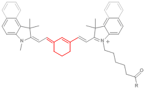

Application schémas neurosciences faciles : [Biorender](https://biorender.com/)

## Atlases (histology) :

https://portal.brain-map.org/

http://atlas.brain-map.org/

## Mice lines :

#### Gcamp:

Mouses expressing cre-dependant Gcamp : **AI95**

Mouses expressing ubiquitous CRE : **EMX_cre**

##### Dyes :

RH1691

## Techniques d'imagerie :

[Lifetime Imaging](https://www.leica-microsystems.com/fr/applications/sciences-de-la-vie/fluorescence-lifetime-imaging/) (FLIM)

