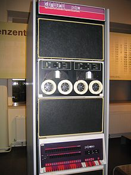
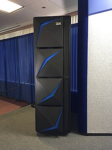

- Software to check folder size and file usage on windows tree and on hard drives in a visual manner - logiciel taille dossiers fichiers sur disque : [**Windirstat**](https://windirstat.net/)

- Transfer files automatic software with fine control : **FreeFileSync**
- **Winmerge** : merge and visualise two text files (or other file types) diffs - Equivalent for mac : [filemerge or kaleidoscope](https://www.youtips.com/comparer-deux-fichiers-avec-filemerge-ou-kaleidoscope/)

Useful calculation and search engine : [Wolfram Alpha](https://www.wolframalpha.com)

[Change User credentials for shared folders](https://www.top-password.com/blog/clear-saved-credentials-for-network-share-or-remote-desktop/) 

- [quickSFV](https://www.quicksfv.org/) 

> **Simple file verification** (**SFV**) is a file format for storing [CRC32](https://en.wikipedia.org/wiki/CRC32) [checksums](https://en.wikipedia.org/wiki/Checksum) of files to verify the integrity of files

### Storage :

Oracle storage nodes : [config](https://docs.oracle.com/cd/E19114-01/sol.backup51/805-3795/6j3jtvjmr/index.html) , [fully pre-configured racks](https://docs.oracle.com/en/storage/index.html)

**feather** ( fast but maybe not stable over time - versions - saying it is stable for featehr v2...)

**parquet** ( a bit less fast but more stable )

**pickle** ( correct speed and reliable ) very stable and ultra high compatibility in python

**hdf** ( not fast, very stable , and not lightweighted... )

**csv** is shit but at least is readable by humans

[Safely wipe a hard drive (to sell on ebay or to scrap recyclers)](https://www.makeuseof.com/tag/how-to-wipe-a-hard-drive/)

### Network and Internet:

[Add google analytics to a github page](https://stackoverflow.com/questions/17207458/how-to-add-google-analytics-tracking-id-to-github-pages)

Oamos, a strange search engine [ref](https://www.youtube.com/watch?v=L4_cfJ_QPKg)

[Deserialization attacks](https://medium.com/gdg-vit/deserialization-attacks-d312fbe58e7d)

### Computer science hardware :

[Small Computer System Interface](https://fr.wikipedia.org/wiki/Small_Computer_System_Interface)

[Sata](https://fr.wikipedia.org/wiki/Serial_ATA) 

[Processeur a jeu d'instructions réduit](https://fr.wikipedia.org/wiki/Processeur_%C3%A0_jeu_d%27instructions_r%C3%A9duit)

[Serveur lame](https://fr.wikipedia.org/wiki/Serveur_lame)

[superordinatuer](https://fr.wikipedia.org/wiki/Superordinateur)

[CUDA](https://fr.wikipedia.org/wiki/Compute_Unified_Device_Architecture) Compute Unified Device Architecture

["Minicomputer"](https://en.wikipedia.org/wiki/Minicomputer)

> developed in the mid-1960s, with a consensus definition of a minicomputer as a machine with an input-output device such as a teleprinter and at least four  thousand words of memory, that is capable of running programs in a  higher level language, such as [Fortran](https://en.wikipedia.org/wiki/Fortran) or [BASIC](https://en.wikipedia.org/wiki/BASIC). It is now an obsolete form factor, last sales in the 90s

[Mainframe computer](https://en.wikipedia.org/wiki/Mainframe_computer)

> A mainframe computer is large but not as large as supercomputer and has  more processing power than some other classes of computers, such as [minicomputers](https://en.wikipedia.org/wiki/Minicomputer), [servers](https://en.wikipedia.org/wiki/Server_(computing)), [workstations](https://en.wikipedia.org/wiki/Workstation), and [personal computers](https://en.wikipedia.org/wiki/Personal_computer). Most large-scale computer-system architectures were established in the  1960s, but they continue to evolve. Mainframe computers are often used  as servers. It is still a denomination in use.

