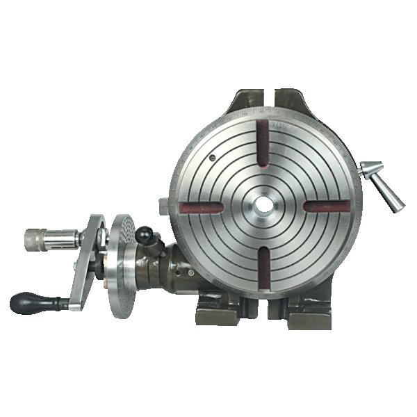

## CAO :

### Solidworks:

!!! info "Automatize tasks:"
    With [Task scheduler](https://blogs.solidworks.com/tech/2017/02/automate-file-exports-solidworks-task-scheduler.html) and scripted macros for solidworks : [Link1](https://www.codestack.net/solidworks-tools/#custom-properties)  - [Link2](http://help.solidworks.com/2018/french/solidworks/sldworks/c_recording_playing_macros.htm).

!!! tip "Variable driven CAO:"
    Possibility to drive variables in solidworks [with a text file](https://www.youtube.com/watch?v=cGe1BIrhnT8) or an excell sheet.

<u>How to realize particular structures :</u>

- [Solidworks - Surface Molettée / Grip](http://cyberspaceandtime.com/LYkb1eb57mw.video+related)

To generate solidworks files from Eagle PCBs : [ref](https://lucidar.me/en/eagle/create-solidworks-3d-model-from-eagle/) - [Github link](https://github.com/CalPolyFSAE/EAGLE-Designs/blob/master/EAGLE%20ULP/EagleIDFExporter.ulp) to ulp file to export IDF board 

### Blender :

[Remesh tool](https://blender-addons.org/instant-meshes-remesh/)

## FAO :

<u>Speeds and feeds :</u> 

[HSM advisor](https://hsmadvisor.com/?page=Download) or android app FSWizard - Calculators

<u>Pupitre de commande :</u> 

- Mach3

- [UCCNC](https://cncdrive.com/UCCNC.html) - (with [UC300](http://www.shop.cncdrive.com/index.php?productID=790) motion controller)

### Solidworks:

[Extract machineable features (auto)](https://www.javelin-tech.com/blog/2019/08/solidworks-cam-standard-milling-setup-extract-machinable-features/)

[Filetage a la fraise](https://www.sandvik.coromant.com/fr-fr/knowledge/threading/thread-milling/pages/default.aspx)

[Editing solidworks cam feed and speeds](https://www.youtube.com/watch?v=Ropu8e9qJLs)

[Create a chamfer in solidworks CAM](https://www.youtube.com/watch?v=fP_JZkG_aZ8)

[Solidworks marlin postprocessor](https://www.thingiverse.com/thing:4097176/comments)

## Motion :

### Drives :

- Alcubiere motor

- Harmonic drive

- Planetary gear drive - ([ref](https://assunmotor.com/products/planetary-gearbox))

- WormGear motoreductor

- Ballscrefr

- Planetary roller srews

	

	[ref](https://www.linearmotiontips.com/planetary-roller-screws/)

### Pulleys :

Pulleys french dristributor : [Tri distribution](https://www.tridistribution.fr/panier?action=show)

### Rails Lineraires :

Super tiny cariages 16 / 12 mm RS : [https://fr.rs-online.com/web/p/blocs-et-chariots-de-guidage/1766655/](https://fr.rs-online.com/web/p/blocs-et-chariots-de-guidage/1766655/) & correspunding rails or 5mm : [https://fr.rs-online.com/web/p/guidages-lineaires-rails/9175958/](https://fr.rs-online.com/web/p/guidages-lineaires-rails/9175958/)

[Linear guides types (non exhaustive)](https://www.automotioncomponents.co.uk/en/page/linear-guides-from-automotion)

| Rail type |                                                              |      |
| --------- | ------------------------------------------------------------ | ---- |
| MGN       | 9C / 9H : same rail, same carrier width, different length carrier |      |
| EGH       |                                                              |      |
| EGW       |                                                              |      |
| HGW       |                                                              |      |
| HGH       |                                                              |      |

[Linear rails on alibaba](https://www.google.com/url?sa=i&url=https%3A%2F%2Fwww.alibaba.com%2Fproduct-detail%2FMGN12H-12mm-mini-Linear-guide-rail_60710288280.html&psig=AOvVaw3aux0OI2r73-0H_ZcrXnsa&ust=1610117487536000&source=images&cd=vfe&ved=0CAIQjRxqFwoTCOjdwpmJiu4CFQAAAAAdAAAAABAa)

Bearing tolerances :

   

[Back to back bearing](https://www.meadinfo.org/2013/01/duplex-bearing-arrangements-back-to-back-face-to-face-tandem.html) arrangement (type DB) (preload mount) 

Face to face (type DF)

[Oleksandr Stepanenko](https://grabcad.com/oleksandr.stepanenko-1) : https://grabcad.com/library/6-dof-parallel-robot-1 Modules de déplacement linéaires et robots 6 axes delta

## Sizes reference :

### Screws : 

<u>**BTR Screws cheatsheet :**</u> 

### Holes : 

<u>**Tap / taraudage diameters for metric screws :**</u>

### Linear rails :

## Mechanisms :

Shibata coupler : https://www.reddit.com/r/3Dprinting/comments/kp8bu8/my_attempt_at_designing_and_printing_a_shibata/

Two way screw : [https://www.thingiverse.com/thing:4690959](https://www.thingiverse.com/thing:4690959)

!!! note inline "[Hettlage drive:](https://fr.wikipedia.org/wiki/Hettlage_Drive) " [video](https://www.youtube.com/watch?v=eWXxiXvfBjg) - Mechanical variable speed adjustment without multiple pinions & plateaux

- <u>3 Jaws chuck :</u> 

[3D model on thingiverse (printable)](https://www.thingiverse.com/make:440884) :

## 3D printing :

[Digital metal](https://digitalmetal.tech/) : very fine metal details service [example video of capabilities](https://www.youtube.com/watch?v=KVvjwWWb_OE)

[Cura new slice engine (arachne)](https://github.com/Ultimaker/Cura/releases/Arachne_engine_alpha)

## Milling : 

Conseil Patrick alu : 2017 (eventuelmt rajouter A) aussi appelé AU4G

- <u>Gears :</u>

How to cut gears on [CNC mill](https://www.youtube.com/watch?v=r7dQj1hWNNM) 

How to cut gears [with a dividing head](https://www.youtube.com/watch?v=Uc6b1g8SHV0)

- <u>Plateau diviseur: ([ref](https://www.otelo.fr/plateaux-diviseurs-rotatifs/otg-38227200/SF-ID-00112209/ref-60664.html))</u>

> Les plateaux rotatifs sont utilisables en position verticale et  horizontale. Le réglage angulaire par s'effectue par vernier gradué ou  par disque divisé.

- Diviseur ( 3 ou 4 mors )

- <u>Fraises :</u>
	- [Fraises miniature](https://www.otelo.fr/catalogue/fraises-miniatures-2-dents-serie-normale-queue-cylindrique-coupe-au-centre-helice-30-carbure-micrograin/t-o-0004090802-skg.html) (finition de haute precision pour "small features")
	- [Fraises miniatures a bout hémisphérique](https://www.otelo.fr/catalogue/fraises-miniatures-bout-hemispherique.html)

	- [Fraise conique / queue d'arronde](https://www.otelo.fr/catalogue/fraises-coniques-et-queue-aronde.html) 
	- [Fraises à fileter (ISO 60°)](https://www.otelo.fr/catalogue/fraises-fileter.html) - hélices à 10° - 15° - 27°
	- [Fraises / barreaux à graver](https://www.otelo.fr/catalogue/barreaux-graver.html)

## Turning :

## EDM :

  [BAXEDM](https://www.youtube.com/channel/UCy4kgsAYxcraee8w5SfqXPA)  on Youtube

Wire EDM : [Understanding wire EDM](https://www.canadianmetalworking.com/canadianmetalworking/article/metalworking/understanding-the-power-of-wire-edm)

- [CryoJet](https://en.wikipedia.org/wiki/CryoJet)

> **CryoJet** / IceJet is a derivative of the machining process called [abrasive waterjet (AWJ) machining](https://en.wikipedia.org/wiki/Water_jet_cutter).[*[citation needed](https://en.wikipedia.org/wiki/Wikipedia:Citation_needed)*] CryoJet/IceJet technology uses [ice](https://en.wikipedia.org/wiki/Ice) particles made of water coming from a running water or freshwater  system to cut material. While the ice particles are cutting material,  they melt and go into the water tank of the machine. The pressurized  water acting as a cutting jet can be re-used, with adequate [filtering](https://en.wikipedia.org/wiki/Water_filter), creating a closed water circuit.[*[citation needed](https://en.wikipedia.org/wiki/Wikipedia:Citation_needed)*] However, the majority of users do not re-use the water. If more widely  used, CryoJet may produce a drastic reduction in the amount of abrasive  waste spill currently produced during the [water jet cutting](https://en.wikipedia.org/wiki/Water_jet_cutting) process, as no mineral [abrasive](https://en.wikipedia.org/wiki/Abrasive) is used by this technology.[[1\]](https://en.wikipedia.org/wiki/CryoJet#cite_note-1)

## Materials :

[Cobalt chrome used in dental milling](https://www.google.com/search?q=cobalt+chrome+dental+milling&client=firefox-b-d&sxsrf=ALeKk009IQTMR2rQ2sKltBZSjhLY4NNF9g:1616592859752&source=lnms&tbm=isch&sa=X&ved=2ahUKEwigiZvZhcnvAhXK7eAKHeM3AzMQ_AUoAXoECAkQAw&biw=1920&bih=938) - [video showing](https://www.youtube.com/watch?v=V_aaoIe2mXo) chrome cobalt milling 

## External Service Providers :

[Faulcon Usinage Mecaniciens](http://www.faulcon.fr/index.php?tg=articles&article=24&idx=More&topics=22&smap_node_id=11&OV3223822393=0a288d9de26f09379ff4bcaf8adeeaef)

[Usineur Mecanicien](https://www.usineur.fr/)

