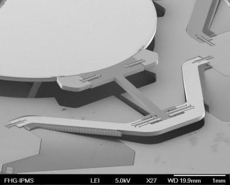
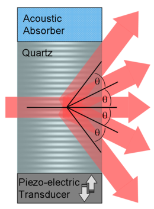
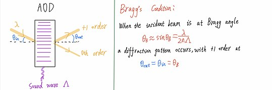
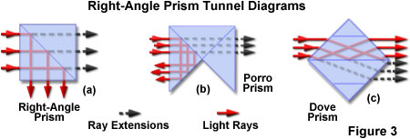
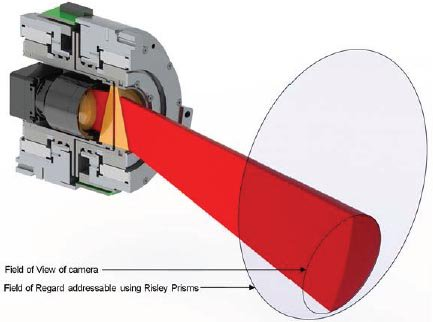

## Theory : 

[Numerical aperture](https://www.zeiss.com/microscopy/int/solutions/reference/basic-microscopy/numerical-aperture-and-resolution.html)

[Collimated light to determine focal length](https://www.edmundoptics.com/knowledge-center/video/tutorials/understanding-collimation-to-determine-optical-lens-focal-length/)

[Lesson on all photonic microscopy techniques and holographic two photon microscopy](https://www.vassanellilab.eu//wp-content/uploads/2016/02/holgraphic-two-photon-microscopy.pdf)

## Whole devices : 

[Holographic screens](https://www.crumpe.com/2020/12/looking-glass-portrait-cadre-photo-qui-transforme-les-portraits-iphone-en-hologrammes-3d/) : Le **Looking Glass portrait**

[Parallax Barrier](https://en.wikipedia.org/wiki/Parallax_barrier) : how to make a "3D" display without glasses 

### Building Laser :

[Instructables schema from laser diode](https://www.instructables.com/id/How-to-build-a-laser-general-guide/)

[Discussion on UV curing glues and UV lamps related](https://www.researchgate.net/post/How_to_choose_a_UV_curing_lamp1) 

## Active components :

### AOM/AOD :

[AOM (acousto optic modulators)](https://en.wikipedia.org/wiki/Acousto-optic_modulator#Modelocking) : 

> An **acousto-optic modulator (AOM)**, also called a **Bragg cell** or an **acousto-optic deflector (AOD)**, uses the [acousto-optic effect](https://en.wikipedia.org/wiki/Acousto-optic_effect) to [diffract](https://en.wikipedia.org/wiki/Diffraction) and shift the frequency of light using [sound waves](https://en.wikipedia.org/wiki/Sound_wave) (usually at [radio-frequency](https://en.wikipedia.org/wiki/Radio-frequency)).

[AOD (acousto optic deflectors)](https://en.wikipedia.org/wiki/Acousto-optic_deflector) : 

> An **acousto-optic deflector** (AOD) spatially controls the optical  beam.  In the operation of an acousto-optic deflector the power driving  the acoustic transducer is kept on, at a constant level, while the  acoustic frequency is varied to deflect the beam to different angular  positions.

### Cameras :

Calculator for working distance, working area, and focal length : https://www.flir.fr/iis/machine-vision/lens-calculator/

[Embeded cards and cameras for AI live work](https://www.theimagingsource.com/embedded-vision/development-kits/nvidia-jetson-nano/?utm_medium=E-Mail&utm_source=Newsletter+on+December+02%2C+2020&utm_campaign=Newsletter+on+December+02%2C+2020+%28en_US%29&utm_content=hero) - Built aroung NVIDIA [Jetson nano](https://developer.nvidia.com/embedded/jetson-nano-developer-kit)

Board cameras : often use **m12**  mount (like raspberry pi ones) also called [S mount (or board lens mount, or CCTV lens mount)](https://en.wikipedia.org/wiki/S-mount_(CCTV_lens))

[**m12**  to c mount adapters](https://www.google.com/search?client=firefox-b-d&q=m12+to+c+mount+adapter) 

[T-Mount](https://en.wikipedia.org/wiki/T-mount)

C-Mount (classic for industrial cameras)

[RMS](https://en.wikipedia.org/wiki/Royal_Microscopical_Society) thread mount (for microscope planapo objectives) - From the royal microscopical society...

<u>Focal distance adaptation :</u> 

[Tutorial n°1](https://nofilmschool.com/2016/08/tutorial-mount-any-lens-your-camera-easy-trick) site web

[Tutorial n°2](https://www.youtube.com/watch?v=dj6Y1SDnQJQ) video youtube

[Tutoriel n°3](https://www.youtube.com/watch?v=UR7JHHgNd38) video youtube

[HyperSpectralImaging (more than 3 spectral lengths)](https://en.wikipedia.org/wiki/Hyperspectral_imaging)

### Linear Arrays : 

[Hamamatsu comparative (up to 46 pixels)](https://www.hamamatsu.com/eu/en/product/optical-sensors/photodiodes/ingaas-photodiode-array/ingaas-photodiode-array/index.html) designed for spectroscopy

<u>InGaAs PIN photodiode array :</u> 
G12430-046D : -46-element array - Large photosensitive area size

## Passive components :

### Optic Fibers

[Fused imaging fiber optics](https://www.schott.com/en-us/products/fused-imaging-fiber-optics) :

> SCHOTT Fused Imaging Fiber Optics can be designed to magnify, minify,  invert or simply transfer an original image to anywhere needed for  defense, medical, and industrial applications.

<u>Multimodal fiber optics : [ref](https://en.wikipedia.org/wiki/Multi-mode_optical_fiber)</u>

- Based on light [modes](https://en.wikipedia.org/wiki/Normal_mode)

- Limited in length by [modal dispersion](https://en.wikipedia.org/wiki/Modal_dispersion)

Image transmission with multimode fibers :

https://yelin.net.technion.ac.il/files/2015/10/Image-transmission-through-fiber.pdf

https://www.nature.com/articles/s41467-019-10057-8

### Lenses :

<u>Refractive Lenses :</u>

[Lens quality and many interesting notions on camera lenses](https://photography.tutsplus.com/articles/everything-you-need-to-know-about-lens-quality--photo-14430) :

- Moulded & Ground Lenses
- Bokeh

Photographic [lens designs](https://en.wikipedia.org/wiki/Photographic_lens_design#Types_of_lenses)  : 

- Planar
- Tessar
- [Sonnar](https://en.wikipedia.org/wiki/Zeiss_Sonnar)

<u>Catadioptric / reflective lenses :</u>

[Catadroptric system](https://en.wikipedia.org/wiki/Catadioptric_system) was often used in the 70-80s for [telephoto](https://en.wikipedia.org/wiki/Telephoto) [lenses](https://en.wikipedia.org/wiki/Photographic_lens). [Advantages and invonvenients :](https://advancedphototech.wordpress.com/lenses/mirror-mirror-a-guide-to-choosing-and-using-mirror-lenses/)

> Advantages : Lightweight , less expensive, no chromatic aberration
>
> Disadvantages : donut bokeh (can be an advantage as it is quite artistic), fixed aperture and focal length, vignetting, low contrast

### Prisms:

- [Wedge Prisms](https://www.thorlabs.com/newgrouppage9.cfm?objectgroup_id=147) : a set of 2 can allow for 2D displacement of a light ray(can be both used for projecting or reading with an adjustable FOV camera) if both are rotatively controlled.
- [Dove prisms](https://www.thorlabs.com/newgrouppage9.cfm?objectgroup_id=6810) are able to retroreflect (and invert) image or rotate the image by twice the angle applied to the prism relative to the image source orientation.

- Risley Prism Beam ([RPUPS - universal pointing system](https://www.spiedigitallibrary.org/conference-proceedings-of-spie/9579/95790B/Risley-prism-universal-pointing-system-RPUPS/10.1117/12.2188088.short?SSO=1)) ( based on wedge prisms )

	

[Anti reflective coating](https://en.wikipedia.org/wiki/Anti-reflective_coating) to reduce reflected light - works in specific wavelength ranges usually

## Suppliers :

Semrock (brightline:registered: )  

Chroma filters 

Optoprim

Edmund optics

Throlabs

Andover corporation

