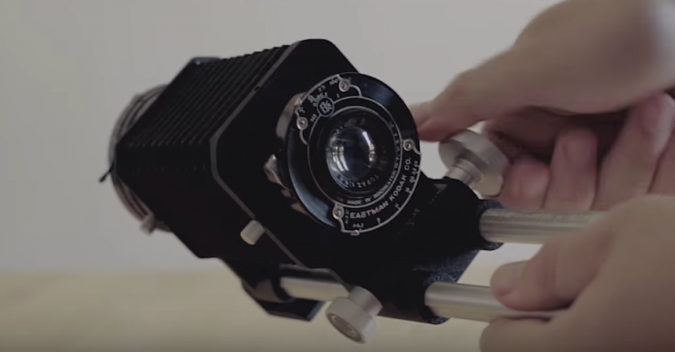
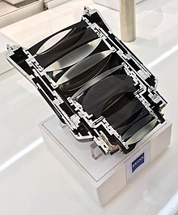

## Theory : 

[Numerical aperture](https://www.zeiss.com/microscopy/int/solutions/reference/basic-microscopy/numerical-aperture-and-resolution.html)

[Collimated light to determine focal length](https://www.edmundoptics.com/knowledge-center/video/tutorials/understanding-collimation-to-determine-optical-lens-focal-length/)

[Non linear optics](https://en.wikipedia.org/wiki/Nonlinear_optics)

[Lesson on all photonic microscopy techniques and holographic two photon microscopy](https://www.vassanellilab.eu//wp-content/uploads/2016/02/holgraphic-two-photon-microscopy.pdf)


[Video quality as a subjective measurement](https://en.wikipedia.org/wiki/Subjective_video_quality) often, using "objective" qualitative measurements doesn't mean the video will "look good"

[Chroma sbsampling](https://en.wikipedia.org/wiki/Chroma_subsampling#4:4:4) taking part of the lower spatial resolution of colors of the retina to make compunded images with color and BW channels subsampled differentely

## Whole devices : 

[Holographic screens](https://www.crumpe.com/2020/12/looking-glass-portrait-cadre-photo-qui-transforme-les-portraits-iphone-en-hologrammes-3d/) : Le **Looking Glass portrait**

[Parallax Barrier](https://en.wikipedia.org/wiki/Parallax_barrier) : how to make a "3D" display without glasses 


### Building Laser :

[Instructables schema from laser diode](https://www.instructables.com/id/How-to-build-a-laser-general-guide/)

[Discussion on UV curing glues and UV lamps related](https://www.researchgate.net/post/How_to_choose_a_UV_curing_lamp1) 

### Microscopes :

**Multi photon :**

**custom access serial holography** :

[Explanation of Walther Akeman's holographic microscope in french](https://www.insb.cnrs.fr/fr/cnrsinfo/des-photons-explorateurs-de-lactivite-neuronale)

## Active components :

### AOM/AOD :

[AOM (acousto optic modulators)](https://en.wikipedia.org/wiki/Acousto-optic_modulator#Modelocking) : 

[](https://en.wikipedia.org/wiki/File:Acousto-optic_Modulator.png)

> An **acousto-optic modulator (AOM)**, also called a **Bragg cell** or an **acousto-optic deflector (AOD)**, uses the [acousto-optic effect](https://en.wikipedia.org/wiki/Acousto-optic_effect) to [diffract](https://en.wikipedia.org/wiki/Diffraction) and shift the frequency of light using [sound waves](https://en.wikipedia.org/wiki/Sound_wave) (usually at [radio-frequency](https://en.wikipedia.org/wiki/Radio-frequency)).

[AOD (acousto optic deflectors)](https://en.wikipedia.org/wiki/Acousto-optic_deflector) : 

[](https://en.wikipedia.org/wiki/File:Bragg's_Condition.jpg)

> An **acousto-optic deflector** (AOD) spatially controls the optical  beam.  In the operation of an acousto-optic deflector the power driving  the acoustic transducer is kept on, at a constant level, while the  acoustic frequency is varied to deflect the beam to different angular  positions.


### Photosensitive devices :

**Measuring their performance :**

[Quantum efficiency](https://en.wikipedia.org/wiki/Quantum_efficiency) :


<u>Cathode radiant sensitivity :</u>

> The responsivity of a cathode to radiation, defined as the ratio of  the current transmitted by the photocathode to the incident radiant  power of a specific wavelength.

#### Cameras :

Calculator for working distance, working area, and focal length : https://www.flir.fr/iis/machine-vision/lens-calculator/

[Embeded cards and cameras for AI live work](https://www.theimagingsource.com/embedded-vision/development-kits/nvidia-jetson-nano/?utm_medium=E-Mail&utm_source=Newsletter+on+December+02%2C+2020&utm_campaign=Newsletter+on+December+02%2C+2020+%28en_US%29&utm_content=hero) - Built aroung NVIDIA [Jetson nano](https://developer.nvidia.com/embedded/jetson-nano-developer-kit)

Board cameras : often use **m12**  mount (like raspberry pi ones) also called [S mount (or board lens mount, or CCTV lens mount)](https://en.wikipedia.org/wiki/S-mount_(CCTV_lens))

[**m12**  to c mount adapters](https://www.google.com/search?client=firefox-b-d&q=m12+to+c+mount+adapter) 

[T-Mount](https://en.wikipedia.org/wiki/T-mount)

C-Mount (classic for industrial cameras)

[RMS](https://en.wikipedia.org/wiki/Royal_Microscopical_Society) thread mount (for microscope planapo objectives) - From the royal microscopical society...

<u>Focal distance adaptation :</u> 




[Tutorial n°1](https://nofilmschool.com/2016/08/tutorial-mount-any-lens-your-camera-easy-trick) site web

[Tutorial n°2](https://www.youtube.com/watch?v=dj6Y1SDnQJQ) video youtube

[Tutoriel n°3](https://www.youtube.com/watch?v=UR7JHHgNd38) video youtube

[HyperSpectralImaging (more than 3 spectral lengths)](https://en.wikipedia.org/wiki/Hyperspectral_imaging)


#### Linear Arrays : 

[Hamamatsu comparative (up to 46 pixels)](https://www.hamamatsu.com/eu/en/product/optical-sensors/photodiodes/ingaas-photodiode-array/ingaas-photodiode-array/index.html) designed for spectroscopy

<u>InGaAs PIN photodiode array :</u> 
G12430-046D : -46-element array - Large photosensitive area size

##### [PhotoMultipler tube](https://en.wikipedia.org/wiki/Photomultiplier_tube) (PMT) :

[MicroPMTs](https://www.hamamatsu.com/eu/en/product/optical-sensors/pmt/micro-pmt.html) as mammamatsu for embeded two photon microscopes.


## Passive components :

[Astigmatism](https://en.wikipedia.org/wiki/Astigmatism_(optical_systems)) (optical) :

> An [optical system](https://en.wikipedia.org/wiki/Optical_system) with **astigmatism** is one where [rays](https://en.wikipedia.org/wiki/Ray_(optics)) that propagate in two perpendicular [planes](https://en.wikipedia.org/wiki/Plane_(mathematics)) have different [foci](https://en.wikipedia.org/wiki/Focus_(optics)).
>

### Optic Fibers

[Fused imaging fiber optics](https://www.schott.com/en-us/products/fused-imaging-fiber-optics) :

> SCHOTT Fused Imaging Fiber Optics can be designed to magnify, minify,  invert or simply transfer an original image to anywhere needed for  defense, medical, and industrial applications.


<u>[Multimode fiber optics](https://www.thorlabs.com/newgrouppage9.cfm?objectgroup_id=10417) : [ref](https://en.wikipedia.org/wiki/Multi-mode_optical_fiber)</u>

- Based on light [mode](https://en.wikipedia.org/wiki/Mode_(electromagnetism)) wich is the orientation of oscilation of magnetic and eletric (H and E) fields regarding the direction of travel of the wave. It's analoguous to mechanical systems normal [modes](https://en.wikipedia.org/wiki/Normal_mode).

- Transmision is limited in length by [modal dispersion](https://en.wikipedia.org/wiki/Modal_dispersion) (about 940 meters)

It simply is a [wave guide](https://en.wikipedia.org/wiki/Waveguide) where the index of the optical core and coating make light undergo total internal reflection, if entering below an acceptance angle (wich value derivates to the number of **aperture** of the fiber)

[Single Mode fibers](https://en.wikipedia.org/wiki/Single-mode_optical_fiber#Quadruply_clad_fiber)

> In [fiber-optic communication](https://en.wikipedia.org/wiki/Fiber-optic_communication), a **single-mode optical fiber** (**SMF**), also known as fundamental- or mono-mode,[[1\]](https://en.wikipedia.org/wiki/Single-mode_optical_fiber#cite_note-1) is an [optical fiber](https://en.wikipedia.org/wiki/Optical_fiber) designed to carry only a single [mode](https://en.wikipedia.org/wiki/Mode_(electromagnetism)) of light - the [transverse mode](https://en.wikipedia.org/wiki/Transverse_mode).
>
> ​      **+** 
>
> - No degradation of signal
>
> - Low dispersion
>
> - Well suited for long distance communication
>
> 	**-**
>
> - Manufacturing and handling is more difficult
>
> - Higher price
>
> - Coupling light into the fiber is difficult

Fundamental modes :

> The lowest order mode of a waveguide.
>
> *Ttransverse modes* (or *lateral modes*). are fundamental modes.
>
> The fundamental mode of a waveguide is the one with the highest [effective refractive index](https://www.rp-photonics.com/effective_refractive_index.html).

[Higher order mode :](https://www.rp-photonics.com/higher_order_modes.html) 

> Basically, all modes other than the fundamental are higher order modes.
>
> Not all waveguides support higher-order modes, at least not within their guided modes; they are then called *single-mode waveguides*
>
> Higher-order modes are more susceptible to attenuation in wave guides. They are also more sensitive to bending loss.
>
> Better for light throughput at lower distances (like LED or lamp launch condition, overfilled.)

[Lower order mode :](https://www.yourdictionary.com/low-order-mode)

> A physical path taken by a signal or signal component that is either  parallel to or relatively modestly transverse to the waveguide. Some signal components travel directly through the center of the waveguide,  at least theoretically, and, therefore, travel the shortest possible  distance between the point at which they enter the waveguide and the  point at which they exit the waveguide. They are the one that occur more with an underfilled launch condition (laser input) better for light throughput at long distances (>10/20m). Less sensitive to bending loss and attenuation.


Image transmission with multimode fibers :

https://www.thorlabs.com/newgrouppage9.cfm?objectgroup_id=10417

https://yelin.net.technion.ac.il/files/2015/10/Image-transmission-through-fiber.pdf

https://www.nature.com/articles/s41467-019-10057-8

### Lenses :

[Hyperfocal distance](https://en.wikipedia.org/wiki/Hyperfocal_distance)

[Advantages of an infinity corrected optical system](https://www.olympus-ims.com/en/microscope/terms/feature15/)

<u>Refractive Lenses :</u>

[Lens quality and many interesting notions on camera lenses](https://photography.tutsplus.com/articles/everything-you-need-to-know-about-lens-quality--photo-14430) :

- Moulded & Ground Lenses
- Bokeh

Photographic [lens designs](https://en.wikipedia.org/wiki/Photographic_lens_design#Types_of_lenses)  : 

[](https://en.wikipedia.org/wiki/File:Zeiss_Otus_55mm_f1.4_cut.jpg)

- Planar
- Tessar
- [Sonnar](https://en.wikipedia.org/wiki/Zeiss_Sonnar)
- [Spheric and aspherical lenses](https://en.wikipedia.org/wiki/Spherical_aberration)
- Achromatic doublets (achromat, apochromat, superachromat)

<u>Catadioptric / reflective lenses :</u>

[Catadioptric system](https://en.wikipedia.org/wiki/Catadioptric_system) was often used in the 70-80s for [telephoto](https://en.wikipedia.org/wiki/Telephoto) [lenses](https://en.wikipedia.org/wiki/Photographic_lens). [Advantages and invonvenients :](https://advancedphototech.wordpress.com/lenses/mirror-mirror-a-guide-to-choosing-and-using-mirror-lenses/)

> Advantages : Lightweight , less expensive, no chromatic aberration
>
> Disadvantages : donut bokeh (can be an advantage as it is quite artistic), fixed aperture and focal length, vignetting, low contrast

 [Scan lenses :](https://www.thorlabs.com/newgrouppage9.cfm?objectgroup_id=10764)

[Tube lenses :](https://www.thorlabs.com/newgrouppage9.cfm?objectgroup_ID=5834)

Make image at infinity (to use with [infinity-corrected objectives](https://www.olympus-ims.com/en/microscope/terms/feature15/) that are a standard for modern microscopes manufacturers)


### Prisms:


- [Wedge Prisms](https://www.thorlabs.com/newgrouppage9.cfm?objectgroup_id=147) : a set of 2 can allow for 2D displacement of a light ray(can be both used for projecting or reading with an adjustable FOV camera) if both are rotatively controlled.
- [Dove prisms](https://www.thorlabs.com/newgrouppage9.cfm?objectgroup_id=6810) are able to retroreflect (and invert) image or rotate the image by twice the angle applied to the prism relative to the image source orientation. http://ishikawa-vision.org/vision/rollcamera/index-e.html

- Risley Prism Beam ([RPUPS - universal pointing system](https://www.spiedigitallibrary.org/conference-proceedings-of-spie/9579/95790B/Risley-prism-universal-pointing-system-RPUPS/10.1117/12.2188088.short?SSO=1)) ( based on wedge prisms )

```

```


[Anti reflective coating](https://en.wikipedia.org/wiki/Anti-reflective_coating) to reduce reflected light - works in specific wavelength ranges usually


## Suppliers :

Semrock (brightline:registered: )  

Chroma filters 

Optoprim

Edmund optics

Throlabs

Andover corporation


## Bibliography :

- Edmund Optics : [Light polarization technique](https://www.edmundoptics.eu/knowledge-center/application-notes/illumination/successful-light-polarization-techniques/)

- Article : [High-brightness polarized light-emitting diodes](https://www.nature.com/articles/lsa201222)

- 
