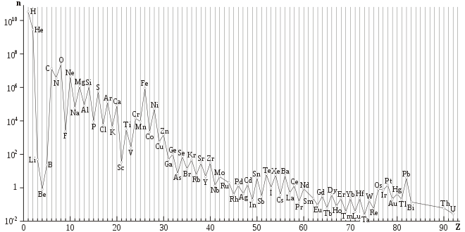

## Effects :

#### [Effet oddo harkins ](https://fr.wikipedia.org/wiki/Effet_d%27Oddo-Harkins) :

> L'**effet d'Oddo-Harkins** désigne le fait que l'[abondance naturelle](https://fr.wikipedia.org/wiki/Abondance_naturelle) des [éléments chimiques](https://fr.wikipedia.org/wiki/Élément_chimique) de [numéros atomiques](https://fr.wikipedia.org/wiki/Numéro_atomique) supérieurs à 4 est plus élevée lorsque ces numéros atomiques sont pairs que lorsqu'ils sont impairs. Ceci s'observe à l'échelle de la [Voie lactée](https://fr.wikipedia.org/wiki/Voie_lactée) aussi bien que du [système solaire](https://fr.wikipedia.org/wiki/Système_solaire) et, dans une certaine mesure, de la [croûte terrestre](https://fr.wikipedia.org/wiki/Croûte_terrestre), où, par exemple, l'abondance relative des [lanthanides](https://fr.wikipedia.org/wiki/Lanthanide), qui forment une [famille](https://fr.wikipedia.org/wiki/Famille_d'éléments_chimiques) de quinze éléments aux propriétés chimiques très homogènes.

#### Capture Neutronique :

> En [physique nucléaire](https://fr.wikipedia.org/wiki/Physique_nucléaire), la **capture neutronique** est le processus par lequel un [noyau](https://fr.wikipedia.org/wiki/Noyau_atomique) capture un [neutron](https://fr.wikipedia.org/wiki/Neutron) sans se désintégrer (et émet un [rayonnement gamma](https://fr.wikipedia.org/wiki/Rayonnement_gamma) pour évacuer l'[énergie](https://fr.wikipedia.org/wiki/Énergie) en excès). Ils [fusionnent](https://fr.wikipedia.org/wiki/Fusion_nucléaire) pour former un noyau plus lourd. Comme les neutrons n'ont pas de [charge électrique](https://fr.wikipedia.org/wiki/Charge_électrique), ils peuvent entrer dans un noyau plus facilement que les particules chargées positivement, qui sont repoussées [électrostatiquement](https://fr.wikipedia.org/wiki/Électrostatique).
>
> La capture de neutrons joue un rôle important dans la [nucléosynthèse](https://fr.wikipedia.org/wiki/Nucléosynthèse) cosmique des éléments lourds. Dans les [étoiles](https://fr.wikipedia.org/wiki/Étoile), elle peut se produire de deux façons - comme un processus rapide ([processus r](https://fr.wikipedia.org/wiki/Processus_r)) ou un processus lent ([processus s](https://fr.wikipedia.org/wiki/Processus_s)).
>
> Les noyaux de masses atomiques supérieures à 56 ne peuvent pas être formés par des [réactions thermonucléaires](https://fr.wikipedia.org/wiki/Réaction_nucléaire) (par exemple par la fusion nucléaire), mais peuvent être formés par capture de neutrons.

[source](https://fr.wikipedia.org/wiki/Capture_neutronique)

## Elements :

### Actinides (Metaux radioactifs) : 

> [source](https://fr.wikipedia.org/wiki/Actinide)

### Lanthanide : 

> Ce sont des [métaux](https://fr.wikipedia.org/wiki/Métal) brillants avec un éclat argenté qui ternit rapidement lorsqu'ils sont  exposés à l'air libre. Ils sont de moins en moins mous au fur et à  mesure que leur [numéro atomique](https://fr.wikipedia.org/wiki/Numéro_atomique) augmente. Leur [température de fusion](https://fr.wikipedia.org/wiki/Température_de_fusion) et leur [température d'ébullition](https://fr.wikipedia.org/wiki/Point_d'ébullition) sont plus élevées que la plupart des métaux, hormis les [métaux de transition](https://fr.wikipedia.org/wiki/Métal_de_transition). Ils réagissent violemment avec la plupart des [non-métaux](https://fr.wikipedia.org/wiki/Non-métal) et brûlent dans l'air. Cette propriété est exploitée dans les [pierres à briquet](https://fr.wikipedia.org/wiki/Pierre_à_briquet), qui sont constituées d'un alliage de lanthanides, le [mischmétal](https://fr.wikipedia.org/wiki/Mischmétal).
>
> Les lanthanides sont [paramagnétiques](https://fr.wikipedia.org/wiki/Paramagnétisme), à l'exception du lanthane, de l'ytterbium et du lutécium, qui n'ont pas d'électron célibataire. Cela se traduit par une [susceptibilité magnétique](https://fr.wikipedia.org/wiki/Susceptibilité_magnétique) élevée pour ces éléments. Le [gadolinium](https://fr.wikipedia.org/wiki/Gadolinium) devient [ferromagnétique](https://fr.wikipedia.org/wiki/Ferromagnétisme) en dessous de 16 °C ([point de Curie](https://fr.wikipedia.org/wiki/Point_de_Curie)), tandis que les lanthanides plus lourds ([terbium](https://fr.wikipedia.org/wiki/Terbium), [dysprosium](https://fr.wikipedia.org/wiki/Dysprosium), [holmium](https://fr.wikipedia.org/wiki/Holmium), [erbium](https://fr.wikipedia.org/wiki/Erbium), [thulium](https://fr.wikipedia.org/wiki/Thulium) et [ytterbium](https://fr.wikipedia.org/wiki/Ytterbium)) deviennent ferromagnétiques chacun à une température bien plus faible.

[Néodyme](https://fr.wikipedia.org/wiki/N%C3%A9odyme) 

[source](https://fr.wikipedia.org/wiki/Lanthanide)

