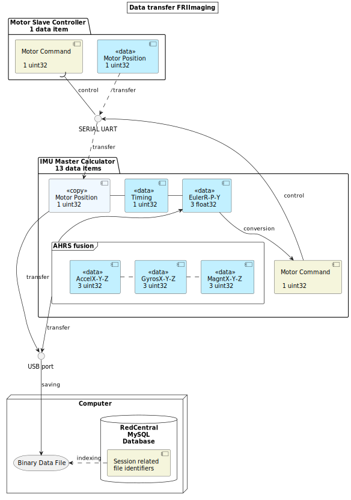

## IDEs :

### VisualStudio :

[How to format code in visual studio](https://stackoverflow.com/questions/5755942/how-do-you-auto-format-code-in-visual-studio)

To format a selection : ++ctrl+k++ - ++ctrl+f++  

To format a document: ++ctrl+k++ - ++ctrl+d++ 

## APIs :

[Restfull API](https://restfulapi.net/http-methods/#get)

> REST APIs enable you to develop all kinds of web applications having all possible CRUD (create, retrieve, update, delete) operations.

[FastAPI](https://fastapi.tiangolo.com/#example)

> FastAPI is a modern, fast (high-performance), web framework for building APIs with Python 3.6+ based on standard Python type hints.

[Typer](https://github.com/tiangolo/typer)

> Typer is a library for building CLI applications that users will **love using** and developers will **love creating**. Based on Python 3.6+ type hints. It's kind  of a version of FastApi for CLI.

[RSTP](https://www.leadtools.com/help/sdk/v21/dh/multimedia/to/creating-an-rtsp-server.html) 

> Real Time Streaming Protocol (RTSP)
>
> Typically, an RTSP server will stream all the files from a certain folder.

[Multicast Camra Frames over LAN](https://elsampsa.github.io/valkka-examples/_build/html/lesson_5.html)

> In this lesson, we are receiving frames from an IP camera using  LiveThread and recast those frames to a multicast address using another  LiveThread.

## GitHub

How to manage [Labels](https://medium.com/@dtinth/how-to-copy-github-labels-from-one-project-to-another-1857adc73e0f) : Using github-label-manager tool (community dev)

[OSSU](https://github.com/ossu/computer-science) :

> Open Source Society University
>
> Path to a free self-taught education in Computer Science! 

[**Numfocus**](https://numfocus.org/sponsored-projects) :  

> From Netflix to NASA, researchers  use NumFOCUS sponsored projects to solve the most challenging problems.  Explore our open source tools by language, features, or industry.
>
> Funding Numpy, matplotlib, pandas, project jupyter....


## Windows :

usefull shell commands : 

| command  | arguments | description                                                  |
| -------- | --------- | ------------------------------------------------------------ |
| ipconfig |           | a classic. Get info mainly about local network of a computer |
| nbstat   |           |                                                              |
|          |           |                                                              |

Freeze a configuration for a multi user computer : 

[Faronics DeepFreeze](https://www.faronics.com/en-uk/products/deep-freeze) - Not free : search for alternatives online


## Conventions :

### IDE flags : 

Scannable notes in code :

`TODO` `BUG` `XXX` `FIXME` `OPTIMIZE` `HACK`

### Styleguides :

[Google styleguides](https://google.github.io/styleguide/)


### Model program structure :

- Agent Interaction Diagram : a way to represent model diagram of agents interactions with a user.
- UML (Universal Modeling Language) : Object oriented way to represent classes and their interactions - [Easy to use with Java](https://www.jmdoudoux.fr/java/dej/chap-uml.htm) 

​		https://plantuml.com/fr/guide

​		https://www.planttext.com/

[		MORJ data transfer with planttext](https://www.planttext.com/api/plantuml/svg/bLHTQzim57tNhxZqQIyEsShe62NKJjejK3UPdSAwPXJDbbrHMJAIt2wC_FTToNQQDCbWVZ3IlUVS3zqZNHXBjMqgGOZ9g61mzd48BpotZz0PFWs7yCXu-MWxmt1mHeZb5fSJQYbOJQKfc8QhP3gjQCbbYS6UkAoffXLagggLPDB27mBuHJHxAhLgP3vMGkdpyno3Z4OGrhNW6RLSoSEuJDKhXqCKYqJ33g4WmaePMHDIeuEM34vYPT6U2lhCOAoarKe8ffSIteFB3DoowWIeWNYsc2LTaQz5txVykJBSbUPv3PVszCFFblGmdwNGTt6OF5PLHMM-FCGUps9NBjgOBcY61QUNoJIyXjimMVYwt6Ahdsby2p4r28Sn5LaZAAPmWKzV-p6Uw91jEmKE0gdXroI5eZ7OXmUu_Lw_OPOnyJsu2tvWqDFjQZ7U0ysoeyr-MMbbZZBBbJv-JBIKzYWJDRNBNB_bNpOuqYIO1tUUNmX5jmEmHXnDlU0L2lRjO1pBSZopVm_sc2eSFPwrmcXb-v_2S07sbN6RHb0hRLjPf14XKkLenp1rWoXlHzgy6xl_6KpaXHDnIVMglRDNN32FZgOt3vDm4NgeQ_KNDOXDM3x6EZKLInclqc_NIpdfd9usYReKzoapJa-W6GgHOIi5XWQU8viNd6dZ-qalqtGwk-ccjmP2keipoDMB78oyoE7pvYqXVjyxNu_pBI9ewk1TTutGcRNtc_H33u9HVvIjznaBSWzCRtJyJVAUJOY_AAsl2qLwyGysOYRzOh1HAI4RuGGxpBRwOAChicrr5U1ajtfhy-_RtTQP-wcXpz1d_-1s9mo37I-NEVlj_HTCvlZC_mK0) :



​		https://github.com/qjebbs/vscode-plantuml/blob/master/README.md


### File path components : 

 `/` -> root
 `.` -> THIS dir path
 `..` -> go "up" one level

<u>Examples :</u> 

 `/a/./b` -> in `/a/b`
 `/a/./b/..` -> `/a/b/..` -> `/a`
 `/a/./b/../..` -> `/a/..` -> `/`
 `/a/./b/../../c` -> `/c`


## File formats :

!!! info inline end "bin files advantages"
     The good point of these files is that writing/reading is fast with numpy arrays or [memmap()](https://stackoverflow.com/questions/40720442/faster-way-to-write-binary-file-with-python-cython)

<u>Fastest to slowest [[ref]](https://towardsdatascience.com/the-best-format-to-save-pandas-data-414dca023e0d):</u>

- bin files (use with struct and an architecture descriptor)
- feather / parquet
- pickle

!!! warning "pandas optimisation with pandas.Categorical"
    There is a very high factor ratio for read / write times between string and `pandas.Categorical` based categorical indexing. Consider use [that type of structure](https://pandas.pydata.org/pandas-docs/stable/user_guide/categorical.html) when using a DataFrame.
!!! info inline end "HDF file viewer"
     An official software called [HDF View](https://support.hdfgroup.org/products/java/hdfview/) allows to inspect HDF files. It can be downloaded [here](https://www.hdfgroup.org/downloads/hdfview/).

- HDF view (e.g. PyTables)

- CSV 

<u>Readable by human :</u> 

- config text files (e.g. ini) 
- yaml or yml files


For configurationtext files : *[stack exchange thread](https://unix.stackexchange.com/questions/54957/what-is-the-difference-between-ini-and-conf)*

> **.ini** -style configuration files may have a format similar to this:
>
> ```ini
> [heading1]
> key1=value
> key2=value
> 
> [heading2]
> a=1
> b=2
> 
> etc...
> ```
>
> **.conf** -style configuration files are more varied. They may look similar to this:
>
> ```json
> # A comment
> button 1 {
>   name "hello"
>   "text" hi.there
>   "more..." {
>     "something 123"  bla.bla "123"
>   }
> }
> 
> # Another comment
> button 2 {
>   # hello
>   x=2
> }
> ```


## 3D space computations :

Graphical 3D space mathematical programming courses & tutorials : Scratchpixel 2.0

[Geometry homepage](https://www.scratchapixel.com/lessons/mathematics-physics-for-computer-graphics/geometry/spherical-coordinates-and-trigonometric-functions) - [Geometry 3D calculations](https://www.scratchapixel.com/lessons/3d-basic-rendering/computing-pixel-coordinates-of-3d-point/mathematics-computing-2d-coordinates-of-3d-points)


## Machine Learning :

[Google's machine learning crash course :](https://developers.google.com/machine-learning/crash-course?hl=fr)<a href="https://developers.google.com/machine-learning/crash-course?hl=fr">

</a>


<iframe src = "http://google.peek.link/2idf">
</iframe>


[FPGA deep learning tutorial](https://software.intel.com/en-us/ai/courses/deep-learning-inference-fpga)

[Convolution artificialNN guide](https://towardsdatascience.com/a-comprehensive-guide-to-convolutional-neural-networks-the-eli5-way-3bd2b1164a53)

[Deep learning eebook by matlab](https://fr.mathworks.com/content/dam/mathworks/ebook/gated/80879v00_Deep_Learning_ebook.pdf)

[Opening deeplearning black box : interpretability deep learning](https://medium.com/@ODSC/opening-the-black-box-interpretability-in-deep-learning-13ecc80ae34e)

Deep Learning : particularly good for solving [Complex Systems](https://en.wikipedia.org/wiki/Complex_system) where very well studied filds interacts with each other (proteomics, cellular biology, fluidics and immunology, for the adaptative imune system , many fields for neurosciences and consciousness, behavioral studies for bridges ! cf Veritasium video on Millenium bridge in London)

With interpretable deep learning : could open a new way in neurosciences.

[Using Deep Learning to Predict Complex Systems: A Case Study in Wind Farm Generation](https://www.hindawi.com/journals/complexity/2018/9327536/)


Recurrent Neuronal Networks : 

- [Long short term memory](https://en.wikipedia.org/wiki/Long_short-term_memory)


## Languages / Frameworks existing : 

Tools


WEB frameworks


Cloud platforms


Databases


### Old languages :

Cobol : [COmmon Business Oriented Language](https://fr.wikipedia.org/wiki/Cobol)

## Some vocabulary : 

[Managed code ](https://en.wikipedia.org/wiki/Managed_code) : 

> is computer program code that requires and will execute only under the management of a [Common Language Infrastructure](https://en.wikipedia.org/wiki/Common_Language_Infrastructure) (CLI) or other types of virtual machines.Le terme de *managed code* provenant de Microsoft ne fait pas partie de la terminologie [Java](https://fr.wikipedia.org/wiki/Java_(langage)), mais le même concept existe : du code exécuté dans la [JVM](https://fr.wikipedia.org/wiki/Java_Virtual_Machine) bénéficie de plusieurs avantages du code managé, dont notamment le [ramasse-miettes](https://fr.wikipedia.org/wiki/Ramasse-miettes_(informatique)).

[Garbage colletor](https://en.wikipedia.org/wiki/Garbage_collection_(computer_science)) :

> In [computer science](https://en.wikipedia.org/wiki/Computer_science), **garbage collection** (**GC**) is a form of automatic [memory management](https://en.wikipedia.org/wiki/Memory_management). The *garbage collector* attempts to reclaim memory which was allocated by the program, but is no longer referenced—also called *[garbage](https://en.wikipedia.org/wiki/Garbage_(computer_science))* There is several strategies for automatic garbage detection.

[Esoteric language or Esolang :](https://en.wikipedia.org/wiki/Esoteric_programming_language#Befunge)

> An **esoteric programming language** (sometimes shortened to **esolang**) is a [programming language](https://en.wikipedia.org/wiki/Programming_language) designed to test the boundaries of computer programming language design, as a [proof of concept](https://en.wikipedia.org/wiki/Proof_of_concept), as [software art](https://en.wikipedia.org/wiki/Software_art), as a hacking interface to another language (particularly [functional programming](https://en.wikipedia.org/wiki/Functional_programming) or [procedural programming](https://en.wikipedia.org/wiki/Procedural_programming) languages), or as a joke.  The use of *[esoteric](https://en.wiktionary.org/wiki/esoteric)* distinguishes these languages from programming languages that working  developers use to write software. Usually, an esolang's creators do not  intend the language to be used for mainstream programming, although some esoteric features, such as [visuospatial](https://en.wikipedia.org/wiki/Visuospatial) [syntax](https://en.wikipedia.org/wiki/Syntax_(programming_languages)),[[1\]](https://en.wikipedia.org/wiki/Esoteric_programming_language#cite_note-1)  have inspired practical applications in the arts.  Such languages are often popular among [hackers](https://en.wikipedia.org/wiki/Hacker_(hobbyist)) and hobbyists.

[Closures](https://en.wikipedia.org/wiki/Closure_(computer_programming)#Closure-like_constructs) : 

> In [programming languages](https://en.wikipedia.org/wiki/Programming_language), a **closure**, also **lexical closure** or **function closure**, is a technique for implementing [lexically scoped](https://en.wikipedia.org/wiki/Lexically_scoped) [name binding](https://en.wikipedia.org/wiki/Name_binding) in a language with [first-class functions](https://en.wikipedia.org/wiki/First-class_function). [Operationally](https://en.wikipedia.org/wiki/Operational_semantics), a closure is a [record](https://en.wikipedia.org/wiki/Record_(computer_science)) storing a [function](https://en.wikipedia.org/wiki/Function_(computer_science))[[a\]](https://en.wikipedia.org/wiki/Closure_(computer_programming)#cite_note-1) together with an environment.[[1\]](https://en.wikipedia.org/wiki/Closure_(computer_programming)#cite_note-2) The environment is a mapping associating each [free variable](https://en.wikipedia.org/wiki/Free_variable) of the function (variables that are used locally, but defined in an enclosing scope) with the [value](https://en.wikipedia.org/wiki/Value_(computer_science)) or [reference](https://en.wikipedia.org/wiki/Reference_(computer_science)) to which the name was bound when the closure was created.[[b\]](https://en.wikipedia.org/wiki/Closure_(computer_programming)#cite_note-3) Unlike a plain function, a closure allows the function to access those *captured variables* through the closure's copies of their values or references, even when the function is invoked outside their scope.

[Singletons](https://en.wikipedia.org/wiki/Singleton_pattern) :

> In [software engineering](https://en.wikipedia.org/wiki/Software_engineering), the **singleton pattern** is a [software design pattern](https://en.wikipedia.org/wiki/Software_design_pattern) that restricts the [instantiation](https://en.wikipedia.org/wiki/Instantiation_(computer_science)) of a [class](https://en.wikipedia.org/wiki/Class_(computer_programming)) to one "single" instance. This is useful when exactly one object is needed to coordinate actions across the system.
>
> The term comes from the [mathematical concept of a singleton](https://en.wikipedia.org/wiki/Singleton_(mathematics)).
