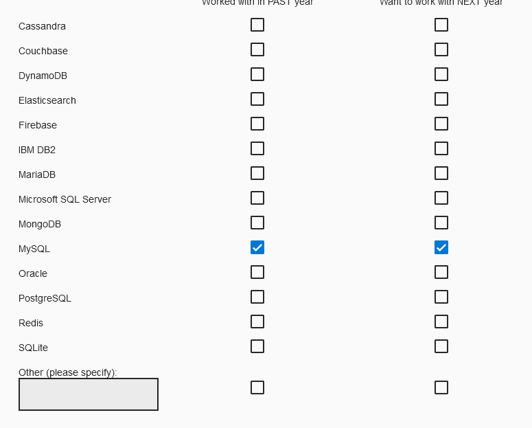

## IDE :

### VisualStudio :

[How to format code in visual studio](https://stackoverflow.com/questions/5755942/how-do-you-auto-format-code-in-visual-studio)

To format a selection : ++ctrl+k++ - ++ctrl+f++  

To format a document: ++ctrl+k++ - ++ctrl+d++ 

## Conventions :

Scannable notes in code :

`TODO` `BUG` `XXX` `FIXME` `OPTIMIZE` `HACK`

[Google styleguides](https://google.github.io/styleguide/)

## Model program structure :

- Agent Interaction Diagram : a way to represent model diagram of agents interactions with a user.
- UML (Universal Modeling Language) : Object oriented way to represent classes and their interactions - [Easy to use with Java](https://www.jmdoudoux.fr/java/dej/chap-uml.htm) 

## File formats :

!!! info inline end "bin files advantages"
     The good point of these files is that writing/reading is fast with numpy arrays or [memmap()](https://stackoverflow.com/questions/40720442/faster-way-to-write-binary-file-with-python-cython)

<u>Fastest to slowest [[ref]](https://towardsdatascience.com/the-best-format-to-save-pandas-data-414dca023e0d):</u>

- bin files (use with struct and an architecture descriptor)
- feather / parquet
- pickle

!!! warning "pandas optimisation with pandas.Categorical"
    There is a very high factor ratio for read / write times between string and `pandas.Categorical` based categorical indexing. Consider use [that type of structure](https://pandas.pydata.org/pandas-docs/stable/user_guide/categorical.html) when using a DataFrame.
!!! info inline end "HDF file viewer"
     An official software called [HDF View](https://support.hdfgroup.org/products/java/hdfview/) allows to inspect HDF files. It can be downloaded [here](https://www.hdfgroup.org/downloads/hdfview/).

- HDF view (e.g. PyTables)

- CSV 

<u>Readable by human :</u> 

- config text files (e.g. ini) 
- yaml or yml files

## 3D space computations :

Graphical 3D space mathematical programming courses & tutorials : Scratchpixel 2.0

[Geometry homepage](https://www.scratchapixel.com/lessons/mathematics-physics-for-computer-graphics/geometry/spherical-coordinates-and-trigonometric-functions) - [Geometry 3D calculations](https://www.scratchapixel.com/lessons/3d-basic-rendering/computing-pixel-coordinates-of-3d-point/mathematics-computing-2d-coordinates-of-3d-points)

## Machine Learning :

[FPGA deep learning tutorial](https://software.intel.com/en-us/ai/courses/deep-learning-inference-fpga)

[Convolution artificialNN guide](https://towardsdatascience.com/a-comprehensive-guide-to-convolutional-neural-networks-the-eli5-way-3bd2b1164a53)

[Deep learning eebook by matlab](https://fr.mathworks.com/content/dam/mathworks/ebook/gated/80879v00_Deep_Learning_ebook.pdf)

[Opening deeplearning black box : interpretability deep learning](https://medium.com/@ODSC/opening-the-black-box-interpretability-in-deep-learning-13ecc80ae34e)

Deep Learning : particularly good for solving [Complex Systems](https://en.wikipedia.org/wiki/Complex_system) where very well studied filds interacts with each other (proteomics, cellular biology, fluidics and immunology, for the adaptative imune system , many fields for neurosciences and consciousness, behavioral studies for bridges ! cf Veritasium video on Millenium bridge in London)

With interpretable deep learning : could open a new way in neurosciences.

[Using Deep Learning to Predict Complex Systems: A Case Study in Wind Farm Generation](https://www.hindawi.com/journals/complexity/2018/9327536/)

Recurrent Neuronal Networks : 

- [Long short term memory](https://en.wikipedia.org/wiki/Long_short-term_memory)

## Languages / Frameworks existing : 

Tools

WEB frameworks

Cloud platforms

Databases

[Managed code ](https://en.wikipedia.org/wiki/Managed_code) : 

> is computer program code that requires and will execute only under the management of a [Common Language Infrastructure](https://en.wikipedia.org/wiki/Common_Language_Infrastructure) (CLI) or other types of virtual machines.Le terme de *managed code* provenant de Microsoft ne fait pas partie de la terminologie [Java](https://fr.wikipedia.org/wiki/Java_(langage)), mais le même concept existe : du code exécuté dans la [JVM](https://fr.wikipedia.org/wiki/Java_Virtual_Machine) bénéficie de plusieurs avantages du code managé, dont notamment le [ramasse-miettes](https://fr.wikipedia.org/wiki/Ramasse-miettes_(informatique)).

[Garbage colletor](https://en.wikipedia.org/wiki/Garbage_collection_(computer_science)) :

> In [computer science](https://en.wikipedia.org/wiki/Computer_science), **garbage collection** (**GC**) is a form of automatic [memory management](https://en.wikipedia.org/wiki/Memory_management). The *garbage collector* attempts to reclaim memory which was allocated by the program, but is no longer referenced—also called *[garbage](https://en.wikipedia.org/wiki/Garbage_(computer_science))* There is several strategies for automatic garbage detection.

