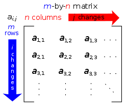

[Increasing python speed](https://blog.paperspace.com/boosting-python-scripts-cython/) with Cython variables definition

[Native functions](https://docs.python.org/fr/3.6/library/functions.html#id)

[Python weird "pass reference by value".](https://robertheaton.com/2014/02/09/pythons-pass-by-object-reference-as-explained-by-philip-k-dick/)

[datetime formats in python](https://strftime.org/) 

## Packaging :

[Create a package](https://packaging.python.org/tutorials/packaging-projects/)


## Modules :

### Built-ins :

Arguments [**types** specification](https://stackoverflow.com/questions/2489669/how-do-python-functions-handle-the-types-of-the-parameters-that-you-pass-in) in functions and classes : `def function( value : int = defaultvalue ) :`

List : [Sort by parameter class instance list](https://stackoverflow.com/questions/4010322/sort-a-list-of-class-instances-python)

Built in exception types : [List of them](https://docs.python.org/3/library/exceptions.html#TypeError)

#### Bytes :

Examples :

```python
bytes([0x7C]) == b'\x7C' # IS TRUE
bytes([0xFD,0xFF,0xAE]) == b'\xFd\xff\xae' # IS TRUE
0xFF == 255 # IS TRUE
bytes(2) == b'\x00\x00' == bytes(0x02)  # IS TRUE
```

```python
0x7C == '|' # IS FALSE : even though | hex value is 0x7C. 0x7C written is that way is understood by python as it's unsigned integer decimal value : 124
0x7C ==== '|'.encode() #IS FALSE : '|'/encode returns a byte() type object that cannot be equal to decimals or strings/chars
bytes(0x02) == b'\x02' # IS FALSE : bytes(0x02) gives 2 bytes of 0x00 value. 0xFF gives 255 butes of 0 value
```

```python
In [1]:>>>  0xFF << 8 
65280
```

```python
In [1]:>>> (0xFF << 8).to_bytes(2, byteorder='big')
b'\xff\x00'
```

```python
In [1]:>>> int.from_bytes(b'\x00\x01', byteorder='big', signed=False) 
65280
```

#### list :

A list of size X with all same items A inside : 

```python
alist = [A] * X
```

#### zip :

loop through several list in the same time : 

with :

```python
a = ['a1', 'a2', 'a3']
b = ['b1', 'b2']
```

instead of : 

```python
for i in range(len(a)):
	print( a[i] , a[i] )
```

use **zip** : 

```python
for x, y in zip(a, b):
    print x, y
```

or **map** : 

```python
for x, y in map(None, a, b):
    print x, y
```

or **list comprehension** (or LC):

```python
for x, y in [(x,y) for x in a for y in b]:
    print x, y
```

**dict** comprehensions also exists, **set** comprehension as well, and  **tuple** comprehension too but this one requires to be called like : tuple( tuple comprehension expression) as parentheses alone are already used for generator expressions (genex).


#### map :

```python
map(function, iterable[, iterable1, iterable2,..., iterableN])
```

> Pour le premier argument de fonction, nous pouvons soit passer une  fonction définie par l'utilisateur, soit utiliser des fonctions `lambda`, en particulier lorsque l'expression est moins complexe.

```python
map(lambda item: item[] expression, iterable)
```

> `map()` applies `function` to each item in `iterable` in a loop and returns a new iterator that yields transformed items on demand. `function` can be any Python function that takes a number of arguments equal to the number of iterables you pass to `map()`.

```python
def square(number):
	return number ** 2
	
numbers = [1, 2, 3, 4, 5]

squared = map(square, numbers)

list(squared)
```

https://realpython.com/python-map-function/


#### (un)nested for loop :

```python
for x, y in ((a, b) for a in range(arr.shape[0]) for b in range(arr.shape[1])):
    print(x,y)
```

is equal (but faster than) :

```python
for x in range(arr.shape[0]):
	for y in range(arr.shape[1])):
		print(x,y)
```

[source](https://stackoverflow.com/questions/17006641/single-line-nested-for-loops)


#### generators :

with :

```python
favorite_numbers = [6, 57, 4, 7, 68, 95]
```

We can create

```python
def square_all(numbers):
    for n in numbers:
         yield n**2

squares = square_all(favorite_numbers)
```

and

```python
squares = (n**2 for n in favorite_numbers)
```

which are exactly the same.

The first one is called a **generator function** and the second one is called a **generator expression** (also called genex).

Generator expression are like list comprehensions but encapsulated with  `( )` **parenthesis** and not `[ ]` **brackets** and produce a **generator** and not a **list**.

To "consume the generator" one can call `list(squares)`

[source](https://treyhunner.com/2018/06/how-to-make-an-iterator-in-python/)

#### logging and warnings: 

[source](https://docs.python.org/fr/3/howto/logging.html)

[source](https://docs.python.org/3/library/warnings.html)

#### subprocess :

:warning: If using subprocess.popen() with a list as cmd argument  on must specify shell=True for it to work.

#### shutil :

[shutil to copy files](https://stackabuse.com/how-to-copy-a-file-in-python)

### Cython :

!!! example "[Installation](https://anaconda.org/anaconda/cython):"
    
    === "conda"
        ```bash
        conda install -c anaconda cython
        ```
    
    === "pip"
        ```bash
        pip install Cython --install-option="--no-cython-compile"
        ```


Import and execute  [.pyx in library and in jupyter](https://nyu-cds.github.io/python-cython/02-executing/) C compiled primitives files.

[.pxd](https://cython.readthedocs.io/en/latest/src/tutorial/pxd_files.html) files explanation


### Collections :

[deque](https://pythontic.com/containers/deque/introduction) for queueing collections of python objects


### Deeplablcut : 

[Integrating externally labeled data into deeplabcut 2.0](https://forum.image.sc/t/integrating-externally-labeled-data-into-deeplabcut-2-0/21291/2)


### Sockets :

[Nice implementation of sending objects with hash checks over python with sockets](https://gist.github.com/goncalopp/4044625)


### Pickle :

[Pickle issue solving when switching from function definitions in main or in subpackages](https://stackoverflow.com/questions/27732354/unable-to-load-files-using-pickle-and-multiple-modules)

[Pickle extensive explanation with interactions with other packages](https://www.datacamp.com/community/tutorials/pickle-python-tutorial#multiprocessing)

[Move to specific byte location in a pickle file ?](https://stackoverflow.com/questions/40211236/how-to-move-pointer-to-specific-bytes-and-read-using-pickle-library-in-python)


### Matplotlib :

Data visualisation

Make matplotlib output text as text in plots, [not as curves](https://stackoverflow.com/questions/34387893/output-matplotlib-figure-to-svg-with-text-as-text-not-curves) - [2d link](https://matplotlib.org/tutorials/introductory/customizing.html)

When using matplotlib qt5agg ( embeded in qt app ) and in the same notebook, call a plot later, use %matplotlib inline inbetween !!!!!!!

Creating [alpha containing colormaps](https://stackoverflow.com/questions/51601272/python-matplotlib-heatmap-colorbar-from-transparent) : 

[Magnitude spectrum ( fft ) quick vizualisation function](https://matplotlib.org/3.1.0/gallery/lines_bars_and_markers/spectrum_demo.html#sphx-glr-gallery-lines-bars-and-markers-spectrum-demo-py) : ax.magnitude_spectrum( signal , Fs= sampling freq, scale='dB')

[Switching backends](https://matplotlib.org/stable/api/_as_gen/matplotlib.pyplot.switch_backend.html) from qt5 to inline in python (no %magic)

[Save plots to numpy arrays **directly**](https://stackoverflow.com/questions/7821518/matplotlib-save-plot-to-numpy-array)

- 

	- [Pcolormesh](https://matplotlib.org/stable/gallery/statistics/time_series_histogram.html#sphx-glr-gallery-statistics-time-series-histogram-py) (for time series (histogram based averaging) 

		


- **Seaborn** :

	- Setting figure size : 

		```python
		sns.set(rc={'figure.figsize':(11.7,8.27)})
		```

- **Plotly** :

	- [Layouts](https://dash.plotly.com/layout)
	- PCA visualisation [ref](https://plotly.com/python/pca-visualization/)
	- Sankey diagram : [ref](https://plotly.com/python/sankey-diagram/)


- **Scipy** :
	- [Dendrogram](https://stackoverflow.com/questions/35490371/how-to-visualize-dendrogram-a-dictionary-of-hierarchical-items) [](https://i.stack.imgur.com/WEsvk.png)

- **Bokeh** : 

	[Live data visualisation (interactive)](https://realpython.com/python-data-visualization-bokeh/)

	https://dash.plotly.com/layout - [Another one](https://medium.com/plotly/introducing-dash-5ecf7191b503)

	[Bokeh dash comparison](https://www.sicara.ai/blog/2018-01-30-bokeh-dash-best-dashboard-framework-python)

	[Bokeh introduction](https://realpython.com/python-data-visualization-bokeh/#prepare-the-data)

	[Multiline color and visualisation (better than calling several times the line module)](https://stackoverflow.com/questions/50192139/bokeh-apply-color-map-to-set-of-lines)

	[HoverTool bokeh](https://stackoverflow.com/questions/41380824/python-bokeh-hover-date-time) with [example](http://docs.bokeh.org/en/1.0.2/docs/user_guide/examples/tools_hover_tooltip_formatting.html) and wiki on [plot tools](https://docs.bokeh.org/en/latest/docs/user_guide/tools.html) (drag pinch etc..)

	[Bokeh plot types](https://docs.bokeh.org/en/latest/docs/user_guide/plotting.html)

	

- [**Ipyvolume**](https://github.com/maartenbreddels/ipyvolume) : 

	[](https://cloud.githubusercontent.com/assets/1765949/23901444/8d4f26f8-08bd-11e7-81e6-cedad0a8471c.gif)

	using animations in jupyter notebook / lab based on webGL and Ipython widgets. (ipywidgets)


### Pandas:

!!! info 
    [Creating multindexes](https://towardsdatascience.com/how-to-use-multiindex-in-pandas-to-level-up-your-analysis-aeac7f451fce) and [Pandas multingex groupby](https://towardsdatascience.com/handling-pandas-groupby-and-its-multi-indexes-efae3e6b788c)

!!! danger "ERREUR TRES CHIANTE"
    [settingwithcopywarning](https://www.dataquest.io/blog/settingwithcopywarning/) . Peut 'Corrompre un dataframe'...
    

    Ne pas utiliser le setter 
    ```python
    dataframe["column"] = defaultvalue
    ```
    Il renvoie une copie et fout la merde. Préferer à la place :
    ```python
    dataframe.loc[: , "column"] = defaultvalue 
    ```
    Utiliser **.loc** partout, tout le temps pour setter une ou des valeurs. Pour setter une slice de la même manière, utiliser .xs


### Numpy:

Crosscorrelation : [scipy correlation](https://docs.scipy.org/doc/scipy/reference/generated/scipy.signal.correlate.html)

Subclassing a numpy array : [source](https://numpy.org/doc/stable/user/basics.subclassing.html)

Why numpy is using an origin convetion diffrent than matplotlib :           



> Your graphic is not of a matrix, it is of a Cartesian coordinate  system. As you say, in the Cartesian coordinate system, the first  coordinate give the horizontal position, the second coordinate gives the vertical position, and going up the page means the second coordinate  increases. The location `(0, 0)` is at the lower left of many graphics, but it can be adjust to be anywhere, since each coordinate may be negative.
>
> In a traditional matrix, however, the first coordinate is the row, or vertical position, and the second is the column, horizontal position.  Going up the page means a decreasing first coordinate. Location `(1, 1)` is the upper left corner of any matrix, since each coordinate must be a positive integer. Here is a Wikipedia image [for a matrix](https://en.wikipedia.org/wiki/Matrix_(mathematics)):

[source](https://stackoverflow.com/questions/51849547/why-is-numpys-origin-at-the-upper-left-unlike-mathematical-convention/51849585)

[Broadcasting](https://numpy.org/doc/stable/user/basics.broadcasting.html) : [broadcast_to](https://docs.scipy.org/doc/numpy-1.10.0/reference/generated/numpy.broadcast_to.html)

> A readonly view on the original array with the given shape. It is typically not contiguous. (no memory duplication theoretically)
>
> ```python
> >>> x = np.array([1, 2, 3])
> >>> np.broadcast_to(x, (3, 3))
> array([[1, 2, 3],
>        [1, 2, 3],
>        [1, 2, 3]])
> ```

> The term broadcasting describes how numpy treats arrays with different shapes during arithmetic operations. Subject to certain constraints, the smaller array is “broadcast” across the larger array so that they have compatible shapes. Broadcasting provides a means of vectorizing array operations so that looping occurs in C instead of Python.

<u>Avoiding **nested** for loops on numpy arrays :</u> 

[ndenumerate](https://numpy.org/doc/stable/reference/generated/numpy.ndenumerate.html) : Return an iterator yielding pairs of array coordinates and values.

```python
>>> a = np.array([[1, 2], [3, 4]])
>>> for index, x in np.ndenumerate(a):
>>>	    print(index, x)

(0, 0) 1
(0, 1) 2
(1, 0) 3
(1, 1) 4
```

[meshgrid](https://numpy.org/doc/stable/reference/generated/numpy.meshgrid.html) or [mgrid](https://numpy.org/doc/stable/reference/generated/numpy.ndenumerate.html) 

```python
np.mgrid[0:5,0:5]
array([[[0, 0, 0, 0, 0],
        [1, 1, 1, 1, 1],
        [2, 2, 2, 2, 2],
        [3, 3, 3, 3, 3],
        [4, 4, 4, 4, 4]],
       [[0, 1, 2, 3, 4],
        [0, 1, 2, 3, 4],
        [0, 1, 2, 3, 4],
        [0, 1, 2, 3, 4],
        [0, 1, 2, 3, 4]]])
```

!!! info "Types in numpy:" 
    Numpy uses class objects to encapsule all types of ints ( regardless of bit size, signed or not ) and floats into :
    

~~~python
```python
int: np.integer, float: np.floating
```
Similarly : 

```python
bool: np.bool, str: np.str
```
~~~

With **isinstance()** built in function, the second parameter can be a tuple ,  and if any type inside correcponds to the one on the first parameter: the function returns true : thus we can test any int type with :

``` python
 isinstance( value , ( int , np.integer ))
```

Another tool : np.issubdtype( ) is made to test dtypes and determine if one descend from another ( signed is important here, but not bitsize )

**Ellipsis** =  **. . .**  An object that is used to say 'an arbitrary number of dimensions' - [link](https://stackoverflow.com/questions/12116830/numpy-slice-of-arbitrary-dimensions) 

Example : `slice = myarray[:,:,i]` or `slice = myarray[:,:,:,:,:,i]` both equals : `slice = myarray[..., i]`

find indices of  max values in a multi dimensionnal array : 

```python
indices = np.unravel_index(array.argmax(), array.shape)
```

[source](https://stackoverflow.com/questions/55284090/how-to-find-maximum-value-in-whole-2d-array-with-indices)

Remove dimensions = 1 : [np.squeze](https://numpy.org/doc/stable/reference/generated/numpy.squeeze.html)

### PyQt5:

[Adding and removing widgets programatically](https://stackoverflow.com/questions/8651742/dynamically-adding-and-removing-widgets-in-pyqt)

[Layout management in pyQt5](https://www.learnpyqt.com/tutorials/layouts/)

[PyQt parents widgets, memory leaks, and delete on close (forum)](https://stackoverflow.com/questions/37918012/pyqt-give-parent-when-creating-a-widget)

### Scipy : 

When fitting : primary issue is the function (number of variables, degrees of adjustment, correctly written etc), then the initial values, and if not working, one can adjust the `maxfev` .[source](https://stackoverflow.com/questions/19314402/why-does-scipy-optimize-curve-fit-not-fit-correctly-to-the-data)

<u>2D fitting a curve :</u> 

[source](https://stackoverflow.com/questions/21566379/fitting-a-2d-gaussian-function-using-scipy-optimize-curve-fit-valueerror-and-m) (used, 2D gaussian function py3 compatible, with offset)  [source](https://stackoverflow.com/questions/27539933/2d-gaussian-fit-for-intensities-at-certain-coordinates-in-python) (unused, no offset, fit doesn't converge properly)

### Online modules :

#### pyTube :

[https://pytube.io/en/latest/api.html#pytube.Stream.download](https://pytube.io/en/latest/api.html#pytube.Stream.download)


## Imports :

[Rename module during import to preserve back compatibility](https://stackoverflow.com/questions/24322927/python-how-to-alias-module-name-rename-with-preserving-backward-compatibility)

!!! info "init files :"
    [Namespaces and __init__ files](https://stackoverflow.com/questions/41871239/how-to-use-init-py-in-sub-modules-to-define-namespaces)
    [Put code inside **\_\_init\_\_** files](https://sametmax.com/vous-pouvez-mettre-du-code-dans-__init__-py)
    [Init file explanation (forum)](https://stackoverflow.com/questions/448271/what-is-init-py-for)

!!! tip "[Check class type of an item without having to import it's library](https://stackoverflow.com/questions/49577290/determine-if-object-is-of-type-foo-without-importing-type-foo) : "
    ```python
    (value.__class__.__module__, value.__class__.__name__) == ('numpy', 'ndarray')
    ```

From inside \_\_init\_\_ :

```python
sys.path.append(os.path.dirname(__file__))
```

Necessary because by default, inside init, the `sys.path()` only contains the path to parent folder (if is a subpackage), and thus, can't import modules inside it's corresponding subpackage.

 [source](https://stackoverflow.com/questions/34753206/init-py-cant-find-local-modules) 


## Environments :

If issues with "visual C++ xx.x required" : 

```
pip install --upgrade setuptools
```

**Export :** 

```bat
conda env export > environment.yml
```

Import :


## Documentation:

[Pydoc](https://docs.python.org/fr/2.7/library/pydoc.html) : automatically creates python documentation files in html. with architecture and links. The dream. Just needs to state """ triple quotemarks """ documentation at the top of the function or calsses to explain their usage

​	call it this way : 

```bash
cd <path to the library parent folder>
pydoc -w <path to the library parent folder>
```

[Sourcetrail - Another better flavor](https://github.com/CoatiSoftware/Sourcetrail) for Visualizing and creating graphs of function calls 

[Visualizing and creating graphs of function calls (to create docs)](https://pycallgraph.readthedocs.io/en/master/)

- Numpydoc to Markdown and serve directly (live changes updates): 

	https://github.com/greenape/mktheapidocs

[Pdoc](https://pdoc3.github.io/pdoc/doc/pdoc/#supported-docstring-formats&gsc.tab=0) : kind of the same to pydoc.


YAPF : code formatter (best than autopep8 as it reformat your code even if no violation is found)


[Google python](https://google.github.io/styleguide/pyguide.html#s3.8.1-comments-in-doc-strings) style guide with [docstrings](https://google.github.io/styleguide/pyguide.html#doc-function-returns) infos.

```python
def fetch_smalltable_rows(table_handle: smalltable.Table,
                          keys: Sequence[Union[bytes, str]],
                          require_all_keys: bool = False,
) -> Mapping[bytes, Tuple[str]]:
    """Fetches rows from a Smalltable.

    Retrieves rows pertaining to the given keys from the Table instance
    represented by table_handle.  String keys will be UTF-8 encoded.

    Args:
      table_handle:
        An open smalltable.Table instance.
      keys:
        A sequence of strings representing the key of each table row to
        fetch.  String keys will be UTF-8 encoded.
      require_all_keys:
        Optional; If require_all_keys is True only rows with values set
        for all keys will be returned.

    Returns:
      A dict mapping keys to the corresponding table row data
      fetched. Each row is represented as a tuple of strings. For
      example:

      {b'Serak': ('Rigel VII', 'Preparer'),
       b'Zim': ('Irk', 'Invader'),
       b'Lrrr': ('Omicron Persei 8', 'Emperor')}

      Returned keys are always bytes.  If a key from the keys argument is
      missing from the dictionary, then that row was not found in the
      table (and require_all_keys must have been False).

    Raises:
      IOError: An error occurred accessing the smalltable.
    """

```

Function arguments **default values** and **type hints** syntax :

```python
def foo(opts : dict = {}) -> str:
    return "foobar"
```


## String fomatting :

!!! tip "[f-strings](https://realpython.com/python-f-strings/)"
     The best way (simpler and **faster** exec at runtime !) to format strings (if python > 3.5)


To format numerical values inside f strings :

```python
In [1]: # format floating points
	    val = 12.3
	    print(f'{val:.2f}')
Out[1]: 12.30
```
```python
In [1]: # format datetime values
        import datetime
        now = datetime.datetime.now()
        print(f'{now:%Y-%m-%d %H:%M}')
Out[1]: 2019-05-11 22:39
```
```python
In [1]: # justify to the left (default) and add non significant 0
        x = 3
        print(f'{x:02} {x*x:3}')
		x = 4
		print(f'{x:02} {x*x:3}')
Out[2]: 03   9
    	04  16
```
```python
In [1]: # justify to the right
        s2 = 'ab'
        s3 = 'abc'
 		print(f'{s2:>10}')
        print(f'{s3:>10}')
Out[1]:        ab
       		  abc
```
```python
In [1]: # hexadecimal
        a = 255
        print(f"{a:x}")
Out[1]: ff
```

!!! tip "__str__ and __repr__ peskyness"
    ```python
    f"{new_comedian}" #- using the __str__ function of new_comedian
    >>>'Eric Idle is 74.'
    ```
    
    ```python
    f"{new_comedian!r}" #- using the __repr__ function of new_comedian
    >>>'Eric Idle is 74. Surprise!'
    ```

## Debug : 

[Warnings (for example for deprecation) instead of errors raised](https://stackoverflow.com/questions/3891804/raise-warning-in-python-without-interrupting-program)

[Compilation JIT (just in time) with Numba in python](http://eric.univ-lyon2.fr/~ricco/tanagra/fichiers/fr_Tanagra_Numba_JIT_Python.pdf) (only for function with positionnal aguments)


## Performance : 

### Profiling :

In Ipython notebook, .ipy files or line commands : 

**%timeit** with a space, before a method or satement : time and prints the time taken

### Speeding up python :

[Multiprocessing](https://medium.com/@urban_institute/using-multiprocessing-to-make-python-code-faster-23ea5ef996ba)

[Multiprocessing vs threading](https://timber.io/blog/multiprocessing-vs-multithreading-in-python-what-you-need-to-know/) 

[When using multi processing or multi threading](https://medium.com/towards-artificial-intelligence/the-why-when-and-how-of-using-python-multi-threading-and-multi-processing-afd1b8a8ecca)

[Fixing slow loops](https://www.freecodecamp.org/news/if-you-have-slow-loops-in-python-you-can-fix-it-until-you-cant-3a39e03b6f35/)

[Avoiding nested code](http://thepythoncorner.com/dev/the-art-of-avoiding-nested-code/)

["Never use for loop again (a bit extreme tho)"](https://medium.com/python-pandemonium/never-write-for-loops-again-91a5a4c84baf)

## Classes specificities :

Iterator creation for a class : 

[Iterator class with](https://thispointer.com/python-how-to-make-a-class-iterable-create-iterator-class-for-it/)  **\_\_iter__**  and  **\_\_next__**

[Overloading basics](https://pythonpedia.com/en/tutorial/2063/overloading), operators , etc

[Initialize](https://stackoverflow.com/questions/6560354/how-would-i-create-a-custom-list-class-in-python) parent class in child with **super()**

Explanation of  [Super](https://he-arc.github.io/livre-python/super/index.html)

[MRO (method resolution order ) for classes methods](https://stackoverflow.com/questions/29214888/typeerror-cannot-create-a-consistent-method-resolution-order-mro)

To reload a class in Jupyter lab :

```python
import importlib
importlib.reload(module)
```

Defining a method as a property : @property before the method definition ( can only take one argument then : self )

Making a class able to print a custom layout : use **\_\_repr\_\_** and **\_\_str\_\_** [(source)](https://stackoverflow.com/questions/1535327/how-to-print-instances-of-a-class-using-print)

Get a class bale to supscript itself : use **\_\_getitem\_\_** and **_\_setitem\_\_** [(source)](https://stackoverflow.com/questions/33727217/subscriptable-objects-in-class)

To use leballed supricpt : use getattr(self, name) ( calls an method / property named as variable name )

Slices are returned with this function : https://www.programiz.com/python-programming/methods/built-in/slice where slice is start stop step. If None None : returns all span. Is step none : interpreted as 1

**dir**( class object ) returns all methods and properties of the given object. Interesting to learn and make smarter code

Calling a parent class from child : [**super()**](https://stackoverflow.com/questions/805066/how-to-call-a-parent-classs-method-from-child-class-in-python)

<u>Custom [Iterating](https://stackoverflow.com/questions/2936863/implementing-slicing-in-getitem) over a slice :</u>

```python
def __getitem__( self, key ) :
    if isinstance( key, slice ) :
        #Get the start, stop, and step from the slice
        return [self[ii] for ii in xrange(*key.indices(len(self)))]
    elif isinstance( key, int ) :
        if key < 0 : #Handle negative indices
            key += len( self )
        if key < 0 or key >= len( self ) :
            raise IndexError, "The index (%d) is out of range."%key
        return self.getData(key) #Get the data from elsewhere
    else:
        raise TypeError, "Invalid argument type."
```


[<u>Built in class decorators :</u>](https://www.oreilly.com/library/view/mastering-object-oriented-python/9781783280971/ch08s02.html) 

```python
@staticmethod # To not use self in a class method arguments
@classmethod # To call 'factory' class before the main class and thus be able to define init parameters from the class itself :
			 #https://www.programiz.com/python-programming/methods/built-in/classmethod
@property # To call a method like a property
@wraps  # To get docstrings even if you call a function decorator somewhere 				 
		# https://stackoverflow.com/questions/308999/what-does-functools-wraps-do
@timeit # to profile a function by making a given number of loops on it and printing the mean and sem
```

List of awsome decorators : [Awesome python decorators](https://github.com/lord63/awesome-python-decorator)

Some other usefull decorators[ ( like add to class decorator ): ](https://wiki.python.org/moin/PythonDecoratorLibrary#Easy_adding_methods_to_a_class_instance)


[<u>Built in magics commands :</u>](https://nyu-cds.github.io/python-cython/02-executing/)

```python
%%cython
```


Make a class callable : implement method [ref](https://stackoverflow.com/questions/14585987/making-a-class-callable-in-same-instance)

```python
__class__
```

 


## IDE:

- [Online editor and environment : Google Collab](https://colab.research.google.com/notebooks/)

- Spyder

- Pycharm

- Jupyter notebook and jupyter lab

- Atom ( with hydrogen as runtime execution addon)

## Specific Applications:

[Import from web trick](http://blog.dowski.com/2008/07/31/customizing-the-python-import-system/) 

[Capture specific area screen with python](https://stackoverflow.com/questions/57761132/area-selection-and-capture-of-the-screen-with-python-on-windows)

### Image : 

#### Image enhancement : 

[Edge contrained curve fitting in the threshold decomposition domain (paper)](https://www.eurasip.org/Proceedings/Eusipco/Eusipco2008/papers/1569102178.pdf)

**Superresolution** with DeepNeuralNetworks in opencv. 

- Tuto learnOpencv [ref](https://learnopencv.com/super-resolution-in-opencv/)

- Tuto TowardsDataScience [ref](https://towardsdatascience.com/deep-learning-based-super-resolution-with-opencv-4fd736678066)

#### Image rotation & translation done right : 

[Reprojection with rasterio](https://rasterio.readthedocs.io/en/latest/topics/reproject.html)

#### Shape matching and image calculation attributes :

[PDF on image an shape analysis and measurement](http://www.cyto.purdue.edu/cdroms/micro2/content/education/wirth10.pdf)

[CV2 binary shapes analysis](https://docs.opencv.org/master/d5/d45/tutorial_py_contours_more_functions.html) 

[Moments invariants de Hu (online course)](https://subscription.packtpub.com/book/data/9781789344912/8/ch08lvl1sec93/matching-contours) 

[SIFT technique for image matching](https://www.analyticsvidhya.com/blog/2019/10/detailed-guide-powerful-sift-technique-image-matching-python/) 

#### Machine vision :

[Topic abount basic openCV fucntion for machine vision (and Haar cascade classifiers)](https://www.analyticsvidhya.com/blog/2019/03/opencv-functions-computer-vision-python/)

[Object detection algorithms (convolutionnal neural networks)](https://www.analyticsvidhya.com/blog/2018/10/a-step-by-step-introduction-to-the-basic-object-detection-algorithms-part-1/)

### Others :

**Mathematical Calculations :**

[Graph theory calculation with python](https://www.python-course.eu/graphs_python.php) : usind lists tuples and dictionnaries to define custom class (there may be some fully implemented libraries online but this is better as a tutorial not only to classes def but also to graphs)

**Curvature calculation :**

[Wikipedia curvature](https://en.wikipedia.org/wiki/Curvature#Mean_curvature)

[Wolfram mathematica curvature](https://mathworld.wolfram.com/Curvature.html)

[Curvature calculation (from a github user, taking advantage of Rusinkiewicz's paper)](https://github.com/aymanesouani/curvature_estimation_Rusinkiewicz)

- [Curvature based on fit and derivative](https://gist.github.com/elyase/451cbc00152cb99feac6)

- [Another validation of curvature as fit and derivative](https://stackoverflow.com/questions/50562254/curvature-of-set-of-points)
- [Another validation of curtvature as fit and second derivative](https://stackoverflow.com/questions/47972932/detecting-curvature-of-a-plot)

[Interestig mathematical discussion around curvature](https://math.stackexchange.com/questions/2507540/numerical-way-to-solve-for-the-curvature-of-a-curve)


[Setting write acess to files python](https://stackoverflow.com/questions/36745577/how-do-you-create-in-python-a-file-with-permissions-other-users-can-write)

Conda error "require conda init" chen calling conda activate : [answer : add Anaconda3/library/bin to path](https://superuser.com/questions/1479560/conda-install-package-error-missing-zlib-dll)

##### Education to programing : 

[Codecraft python](https://buzzcoder.gitbooks.io/codecraft-python/content/)

